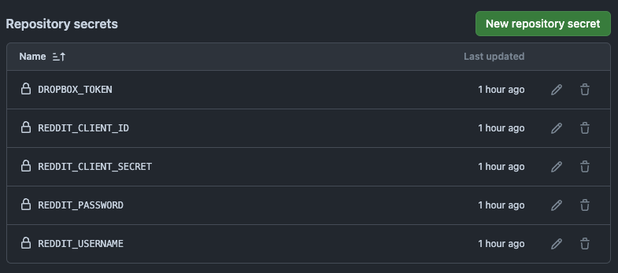

# Reddit Stash

Reddit Stash is a Python script that automatically saves your Reddit saved posts and comments to your local machine or Dropbox. It uses GitHub Actions to run the script on a daily schedule for Dropbox.

## Features
- Downloads the saved Reddit folder from Dropbox.
- Automatically retrieves saved posts and comments from Reddit.
- Uploads the files to Dropbox for storage.
- Saves the content as markdown files.

## Setup

### Prerequisites
- Python 3.10
- A Dropbox account with an API token.
- Reddit API credentials.

### Installation

Before proceeding with any installation method, ensure that you have set the Reddit environment variables. Follow [this guide](#setting-up-reddit-environment-variables) to create a Reddit app and obtain the necessary credentials.

#### GitHub Action Installation

**Note:** The following process requires the [Dropbox App setup](#setting-up-dropbox-app). The GitHub Actions workflow runs the script daily at midnight CET, uploading the files to Dropbox. The workflow is defined in `.github/workflows/reddit_scraper.yml`.

1. **Fork this repository**.

2. **Set Up Secrets:**
- Go to your forked repository’s **Settings** > **Secrets and variables** > **Actions** > Click on **New repository secret**.
- Add the following secrets individually:
    - `REDDIT_CLIENT_ID`
    - `REDDIT_CLIENT_SECRET`
    - `REDDIT_USERNAME`
    - `DROPBOX_TOKEN` (for Dropbox)
- Enter the respective secret values without any quotes.

Example after adding all secrets: .

3. **Manually Trigger the Workflow**:
- Go to the **Actions** tab > Select the **Reddit Stash Workflow** from the list on the left > Click **Run workflow** > Select the branch `main` > Click the green **Run workflow** button. The workflow will then be triggered, and you can monitor its progress in the Actions tab. Upon successful completion, you should see the Reddit folder in your Dropbox.

#### Local Installation

1. **Clone this repository**:
   ```
   git clone https://github.com/rhnfzl/reddit-stash.git
   cd reddit-stash
   ```

2. Install the required Python packages:
    ```
    pip install -r requirements.txt
    ```

3. Setup the [Dropbox App setup](#setting-up-dropbox-app). Skip it if you don't want to setup the dropbox and only want to save the file locally in your system.

4. Set Environment Variables:

    For macOS and Linux:
    ```
    export REDDIT_CLIENT_ID='your_client_id'
    export REDDIT_CLIENT_SECRET='your_client_secret'
    export REDDIT_USERNAME='your_username'
    export REDDIT_PASSWORD='your_password'
    export DROPBOX_TOKEN='dropbox-token'
    ```

    For Windows:

    ```
    set REDDIT_CLIENT_ID='your_client_id'
    set REDDIT_CLIENT_SECRET='your_client_secret'
    set REDDIT_USERNAME='your_username'
    set REDDIT_PASSWORD='your_password'
    set DROPBOX_TOKEN='dropbox-token'
    ```
    
    You can verify the setup with:
    ```
    echo $REDDIT_CLIENT_ID
    echo $REDDIT_CLIENT_SECRET
    echo $REDDIT_USERNAME
    echo $REDDIT_PASSWORD
    echo $DROPBOX_TOKEN
    ```

4. Usage:
    * First-time setup:
    ```
    python reddit_stash.py
    ```
    To upload to Dropbox:
    ```
    python dropbox_utils.py --upload
    ```
    * Subsequent runs, as per your convenience:
    1. Download from Dropbox:
    ```
    python dropbox_utils.py --download
    ```
    2. Process Reddit saved items:
    ```
    python reddit_stash.py
    ```
    3. Upload to Dropbox:
    ```
    python dropbox_utils.py --upload
    ```

#### Setting Up Reddit Environment Variables

* Create a Reddit app at https://old.reddit.com/prefs/apps/
* Set up the name, select `script`, and provide the `redirect_uri` as per the [PRAW docs](https://praw.readthedocs.io/en/latest/getting_started/authentication.html#password-flow).


* Copy the provided `REDDIT_CLIENT_ID` and the `REDDIT_CLIENT_SECRET` based on the following screenshot:


* `REDDIT_USERNAME` is your reddit username
* `REDDIT_PASSWORD` is your reddit passowrd
Keep these credentials for the setup.

#### Setting Up Dropbox app
* Go to [Dropbox Developer App](https://www.dropbox.com/developers/apps).
* Click on Create app.
* Select `Scoped access` and choose `Full Dropbox` for access type.
* Name your app and click `Create app`.

- In the `Permissions` tab, ensure the following are checked under `Files and folders`:
    * `files.metadata.write`
    * `files.metadata.read`
    * `files.content.write`
    * `files.content.read`
    * Click `Submit` in the bottom.

- Go to `Settings` tab scroll down and click on `Generated access token`, this is your `DROPBOX_TOKEN`.
For more information about the setup visit [OAuth Guide](https://developers.dropbox.com/oauth-guide).

### Contributing
Feel free to open issues or submit pull requests if you have any improvements or bug fixes.

### Acknowledgement
- This project was inspired by [reddit-saved-saver](https://github.com/tobiasvl/reddit-saved-saver).