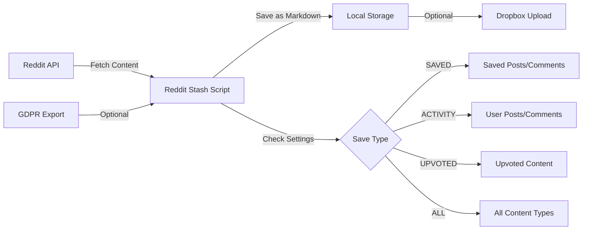

# Reddit Stash: Automatically Save Reddit Posts and Comments to Local or Dropbox

[](https://www.python.org/)
[](https://github.com/features/actions)
[](https://www.dropbox.com/)
[](https://www.reddit.com/dev/api/)
[](LICENSE)

**Reddit Stash** is a Python script designed to help you effortlessly back up your Reddit **saved/ posted/ upvoted** posts and comments to Dropbox or your local machine. Utilizing GitHub Actions, this script runs every 2 hours during peak hours and twice during off-peak hours, automating the process of archiving your Reddit data in Dropbox after a simple setup.

## 📋 What You Get

When Reddit Stash runs successfully, your saved content is organized by subreddit in a clean folder structure and stored as markdown files:

```
reddit/
├── r_AskReddit/
│   ├── POST_abcd123.md           # Your posted content
│   ├── COMMENT_efgh456.md        # Your comments
│   ├── SAVED_POST_xyz789.md      # Posts you saved
│   └── SAVED_COMMENT_def012.md   # Comments you saved
├── r_ProgrammerHumor/
│   ├── UPVOTE_POST_ghi345.md     # Posts you upvoted
│   ├── UPVOTE_COMMENT_mno901.md  # Comments you upvoted
│   └── GDPR_POST_jkl678.md       # From GDPR export (if enabled)
├── gdpr_data/                    # GDPR CSV files (if processing enabled)
│   ├── saved_posts.csv
│   └── saved_comments.csv
└── file_log.json                 # Tracks processed items
```

Each post and comment is formatted with:
- Original title and content
- Author information
- Post/comment URL
- Timestamp
- Subreddit details
- Any images or links from the original post

When Reddit Stash completes processing, you'll receive detailed storage information:
```
Processing completed. 150 items processed, 25 items skipped.
Markdown file storage: 12.45 MB
Media file storage: 89.32 MB
Total combined storage: 101.77 MB
```

This gives you clear visibility into:
- **Text content storage**: How much space your saved posts and comments use
- **Media storage**: How much space downloaded images and videos use
- **Total storage**: Combined space used for your complete Reddit archive

## Table of Contents
- [What You Get](#-what-you-get)
- [How It Works](#how-it-works)
- [Quick Start](#-quick-start)
  - [Setup Method Comparison](#setup-method-comparison)
- [Key Features](#key-features)
- [Why Use Reddit Stash](#-why-use-reddit-stash)
- [Setup](#setup)
  - [Prerequisites](#prerequisites)
  - [Installation](#installation)
    - [GitHub Action Installation](#github-action-installation-recommended)
    - [Local Installation](#local-installation)
    - [Docker Installation](#docker-installation)
  - [Setup Verification Checklist](#setup-verification-checklist)
- [Configuration](#configuration)
  - [Configuration Quick Reference](#configuration-quick-reference)
  - [Configuration Sections](#configuration-sections)
    - [[Settings] - Core Application Behavior](#settings---core-application-behavior)
    - [[Configuration] - Reddit API Credentials](#configuration---reddit-api-credentials)
    - [[Media] - Advanced Media Download System](#media---advanced-media-download-system)
    - [[Imgur] - Imgur API Configuration](#imgur---imgur-api-configuration)
    - [[Recovery] - Content Recovery System](#recovery---content-recovery-system)
    - [[Retry] - Retry Queue Configuration](#retry---retry-queue-configuration)
  - [Important Configuration Notes](#important-configuration-notes)
  - [Setting Up Reddit Environment Variables](#setting-up-reddit-environment-variables)
  - [Setting Up Dropbox App](#setting-up-dropbox-app)
  - [Settings Index (Alphabetical)](#settings-index-alphabetical)
- [Docker Environment Variables](#docker-environment-variables)
- [Alternative Scheduling: External Cron Setup](#alternative-scheduling-external-cron-setup)
- [Important Notes](#important-notes)
  - [About Unsaving](#important-note-about-unsaving)
  - [GDPR Data Processing](#gdpr-data-processing)
- [File Organization and Utilities](#file-organization-and-utilities)
- [Frequently Asked Questions](#frequently-asked-questions)
- [Troubleshooting](#-troubleshooting)
- [Security Considerations](#-security-considerations)
- [Contributing](#contributing)
- [Acknowledgement](#acknowledgement)
- [Project Status](#project-status)
  - [Future Enhancements](#future-enhancements)
- [License](#license)

## How It Works



### Workflow Summary

1. **Data Collection**:
   - The script connects to Reddit's API to fetch your saved, posted, or upvoted content
   - Optionally, it can process your GDPR export data for a complete history

2. **Processing & Organization**:
   - Content is processed based on your settings (SAVED, ACTIVITY, UPVOTED, or ALL)
   - Files are organized by subreddit in a clean folder structure
   - A log file tracks all processed items to avoid duplicates

3. **Storage Options**:
   - Local storage: Content is saved as markdown files on your machine
   - Cloud storage: Optional integration with Dropbox for backup

4. **Deployment Methods**:
   - **GitHub Actions**: Fully automated with scheduled runs and Dropbox integration
   - **Local Installation**: Run manually or schedule with cron jobs on your machine
   - **Docker**: Run in a containerized environment with optional volume mounts

The script is designed to be flexible, allowing you to choose how you collect, process, and store your Reddit content.

## ⚡ Quick Start

For those who want to get up and running quickly, here's a streamlined process:

### Option 1: GitHub Actions (Easiest Setup)

1. Fork this repository.
2. Set up the required secrets in your GitHub repository:
   - From Reddit: `REDDIT_CLIENT_ID`, `REDDIT_CLIENT_SECRET`, `REDDIT_USERNAME`, `REDDIT_PASSWORD`
   - From Dropbox: `DROPBOX_APP_KEY`, `DROPBOX_APP_SECRET`, `DROPBOX_REFRESH_TOKEN`
3. Manually trigger the workflow from the Actions tab.

### Option 2: Local Installation

1. Clone the repository:
   ```bash
   git clone https://github.com/YOUR_USERNAME/reddit-stash.git
   cd reddit-stash
   ```
   Replace `YOUR_USERNAME` with your GitHub username (or use `rhnfzl` if using the original repository).
2. Install dependencies:
   ```bash
   pip install -r requirements.txt
   ```
3. Set up your environment variables and run:
   ```bash
   python reddit_stash.py
   ```

### Option 3: Docker Installation

1. Build the Docker image:
   ```bash
   docker build -t reddit-stash .
   ```
2. Run with your environment variables:
   ```bash
   docker run -it \
     -e REDDIT_CLIENT_ID=your_client_id \
     -e REDDIT_CLIENT_SECRET=your_client_secret \
     -e REDDIT_USERNAME=your_username \
     -e REDDIT_PASSWORD=your_password \
     -e DROPBOX_APP_KEY=your_dropbox_key \
     -e DROPBOX_APP_SECRET=your_dropbox_secret \
     -e DROPBOX_REFRESH_TOKEN=your_dropbox_token \
     -e IMGUR_CLIENT_ID=your_imgur_client_id \
     -e IMGUR_CLIENT_SECRET=your_imgur_client_secret \
     -v $(pwd)/reddit:/app/reddit \
     reddit-stash
   ```
   *Note: IMGUR_CLIENT_ID and IMGUR_CLIENT_SECRET are optional - Imgur API registration is permanently closed, only users with existing applications can use these*

For detailed setup instructions, continue reading the [Setup](#setup) section.

### Setup Method Comparison

| Feature | GitHub Actions | Local Installation | Docker |
|---------|---------------|-------------------|--------|
| **Ease of Setup** | ⭐⭐⭐ (Easiest) | ⭐⭐ | ⭐⭐ |
| **Automation** | ✅ Runs on schedule | ✅ Manual control or cron | ✅ Built-in scheduling support |
| **Requirements** | GitHub account | Python 3.10-3.12 | Docker |
| **Data Storage** | Dropbox required | Local or Dropbox | Local or Dropbox |
| **Maintenance** | Minimal | More hands-on | Low to Medium |
| **Privacy** | Credentials in GitHub secrets | Credentials on local machine | Credentials in container |
| **Best For** | Set & forget users | Power users with customization needs | Containerized environments & flexible scheduling |

## Key Features

- 🤖 **Automated Reddit Backup:** Automatically retrieves saved posts and comments from Reddit, even your posts and comments if you set it up.
- 🔄 **Flexible Storage Options:** Allows for flexible saving options (all activity or only saved items) via `settings.ini`.
- 📦 **Dropbox Integration:** Downloads and uploads the files to Dropbox for storage.
- 📝 **Markdown Support:** Saves the content as markdown files.
- 🔍 **File Deduplication:** Uses intelligent file existence checking to avoid re-downloading content.
- ⏱️ **Rate Limit Management:** Implements dynamic sleep timers to respect Reddit's API rate limits.
- 🔒 **GDPR Data Processing:** Optional processing of Reddit's GDPR export data.
- 🖼️ **Enhanced Media Downloads:** Download images, videos, and other media with dramatically improved success rates (~80% vs previous ~10%), featuring intelligent fallback systems and modern web compatibility.
- 🔄 **Content Recovery System:** 4-provider cascade for failed downloads (Wayback Machine, PullPush.io, Reddit Previews, Reveddit) with SQLite caching and automatic retry across runs.

## 🎯 Why Use Reddit Stash

Reddit Stash was designed with specific use cases in mind:

### 1. Overcome Reddit's Limitations
Reddit only shows your most recent 1000 saved posts. With Reddit Stash, you can save everything and go beyond this limitation.

### 2. Create a Personal Knowledge Base
Many users save technical posts, tutorials, or valuable discussions on Reddit. Reddit Stash helps you build a searchable archive of this knowledge.

### 3. Preserve Content Before It's Deleted
Reddit posts and comments can be deleted by users or moderation. Reddit Stash preserves this content in your personal archive.

### 4. Access Your Content Offline
All of your saved posts are available locally in markdown format, making them easily accessible even without an internet connection.

### 5. Integration with Note-Taking Systems
Since content is saved in markdown, you can easily import it into note-taking systems like Obsidian, Notion, or any markdown-compatible tool.

### 6. Media Preservation
Beyond text, Reddit Stash can download and preserve images, videos, and other media from posts, ensuring you have complete archives even if external hosting services go offline.

## Setup

### Prerequisites
- ✅ Python 3.10-3.12 (Python 3.12 recommended for best performance)
- 🔑 Reddit API credentials
- 📊 A Dropbox account with an API token

### Installation

Before proceeding with any installation method, ensure that you have set the Reddit environment variables. Follow [Reddit API guide](#setting-up-reddit-environment-variables) to create a Reddit app and obtain the necessary credentials.

#### GitHub Action Installation (Recommended)

**Note:** The following process requires the [Dropbox App setup](#setting-up-dropbox-app). The GitHub Actions workflow runs the script every 2 hours during peak hours (6:00-21:00 UTC) and twice during off-peak hours (23:00 and 3:00 UTC), uploading the files to Dropbox. The workflow is defined in `.github/workflows/reddit_scraper.yml`.

1. **Fork this repository**.

2. **Set Up Secrets:**
- Go to your forked repository's **Settings** > **Secrets and variables** > **Actions** > Click on **New repository secret**.
- Add the following secrets individually:
    - `REDDIT_CLIENT_ID`
    - `REDDIT_CLIENT_SECRET`
    - `REDDIT_USERNAME`
    - `REDDIT_PASSWORD`
    For Dropbox Setup
    - `DROPBOX_APP_KEY`
    - `DROPBOX_APP_SECRET`
    - `DROPBOX_REFRESH_TOKEN`
    For Enhanced Media Downloads (Optional - Imgur API registration is permanently closed)
    - `IMGUR_CLIENT_ID` (only if you already have an existing Imgur application)
    - `IMGUR_CLIENT_SECRET` (only if you already have an existing Imgur application)
- Enter the respective secret values without any quotes.

After adding all secrets: .

3. **Manually Trigger the Workflow**:
- Go to the **Actions** tab > Select the **Reddit Stash Scraper** from the list on the left > Click **Run workflow** > Select the branch `main` > Click the green **Run workflow** button. The workflow will then be triggered, and you can monitor its progress in the Actions tab. Upon successful completion, you should see the Reddit folder in your Dropbox.

4. The workflow runs automatically on a schedule:
   - Every 2 hours during *peak hours* (6:00-21:00 UTC)
   - Twice during *off-peak hours* (23:00 and 3:00 UTC)
   - You can adjust these times in the workflow file to match your timezone if needed.

5. **Additional Workflows**: The repository includes automated workflows for maintenance and testing:
   - `python-compatibility.yml`: Tests compatibility across Python versions 3.10-3.12

#### Local Installation

1. **Clone this repository**:
   ```
   git clone https://github.com/YOUR_USERNAME/reddit-stash.git
   cd reddit-stash
   ```
   Replace `YOUR_USERNAME` with your GitHub username (or use `rhnfzl` if using the original repository).

2. Install the required Python packages:
    ```
    pip install -r requirements.txt
    ```

3. Setup the [Dropbox App setup](#setting-up-dropbox-app). Skip it if you don't want to setup the dropbox and only want to save the file locally in your system.

4. Edit the settings.ini file, here is [how to](#settingsini-file)

5. Set Environment Variables (Optional but preferred):

    For macOS and Linux:
    ```
    export REDDIT_CLIENT_ID='your_client_id'
    export REDDIT_CLIENT_SECRET='your_client_secret'
    export REDDIT_USERNAME='your_username'
    export REDDIT_PASSWORD='your_password'
    # Optional, if you need dropbox locally
    export DROPBOX_APP_KEY='dropbox-app-key'
    export DROPBOX_APP_SECRET='dropbox-secret-key'
    export DROPBOX_REFRESH_TOKEN='dropbox-secret-key'
    # Optional, for enhanced Imgur downloading (if you have existing API access)
    export IMGUR_CLIENT_ID='your_imgur_client_id'
    export IMGUR_CLIENT_SECRET='your_imgur_client_secret'
    ```

    For Windows:

    ```
    set REDDIT_CLIENT_ID='your_client_id'
    set REDDIT_CLIENT_SECRET='your_client_secret'
    set REDDIT_USERNAME='your_username'
    set REDDIT_PASSWORD='your_password'
    # Optional, if you need dropbox locally
    set DROPBOX_APP_KEY='dropbox-app-key'
    set DROPBOX_APP_SECRET='dropbox-secret-key'
    set DROPBOX_REFRESH_TOKEN='dropbox-secret-key'
    # Optional, for enhanced Imgur downloading (if you have existing API access)
    set IMGUR_CLIENT_ID='your_imgur_client_id'
    set IMGUR_CLIENT_SECRET='your_imgur_client_secret'
    ```

    You can verify the setup with:
    ```
    echo $REDDIT_CLIENT_ID
    echo $REDDIT_CLIENT_SECRET
    echo $REDDIT_USERNAME
    echo $REDDIT_PASSWORD
    echo $DROPBOX_APP_KEY
    echo $DROPBOX_APP_SECRET
    echo $DROPBOX_REFRESH_TOKEN
    echo $IMGUR_CLIENT_ID
    echo $IMGUR_CLIENT_SECRET
    ```

6. Usage:
    * First-time setup:
    ```
    python reddit_stash.py
    ```
    To upload to Dropbox (optional):
    ```
    python dropbox_utils.py --upload
    ```
    * Subsequent runs, as per your convenience:
    1. Download from Dropbox (optional):
    ```
    python dropbox_utils.py --download
    ```
    2. Process Reddit saved items:
    ```
    python reddit_stash.py
    ```
    3. Upload to Dropbox (optional):
    ```
    python dropbox_utils.py --upload
    ```

#### Docker Installation

You can run Reddit Stash in a Docker container for isolation and consistent environment across different systems.

**1. Build the Docker image**:
```bash
# Build with default Python 3.12
docker build -t reddit-stash .

# Build with specific Python version (optional)
docker build --build-arg PYTHON_VERSION=3.11 -t reddit-stash .
docker build --build-arg PYTHON_VERSION=3.10 -t reddit-stash .
```

**2. Run the container**:

**⚠️ Important: Use single quotes for passwords with special characters**
If your Reddit password contains special characters like `!`, `&`, `$`, etc., use single quotes to prevent shell interpretation:
```bash
-e REDDIT_PASSWORD='your_password_with!special_chars'
```

**Option A: Local-only mode (no Dropbox sync)**

**Single execution** (runs once and exits):
```bash
docker run -it \
  -e REDDIT_CLIENT_ID='your_client_id' \
  -e REDDIT_CLIENT_SECRET='your_client_secret' \
  -e REDDIT_USERNAME='your_username' \
  -e REDDIT_PASSWORD='your_password' \
  -v $(pwd)/reddit:/app/reddit \
  reddit-stash
```

**Periodic execution** (runs every 2 hours automatically):
```bash
docker run -it \
  -e REDDIT_CLIENT_ID='your_client_id' \
  -e REDDIT_CLIENT_SECRET='your_client_secret' \
  -e REDDIT_USERNAME='your_username' \
  -e REDDIT_PASSWORD='your_password' \
  -e SCHEDULE_MODE='periodic' \
  -v $(pwd)/reddit:/app/reddit \
  reddit-stash
```

**Custom interval** (runs every hour):
```bash
docker run -it \
  -e REDDIT_CLIENT_ID='your_client_id' \
  -e REDDIT_CLIENT_SECRET='your_client_secret' \
  -e REDDIT_USERNAME='your_username' \
  -e REDDIT_PASSWORD='your_password' \
  -e SCHEDULE_MODE='periodic' \
  -e SCHEDULE_INTERVAL='3600' \
  -v $(pwd)/reddit:/app/reddit \
  reddit-stash
```

**Option B: Dropbox sync mode (full cloud backup)**

**Single execution** (runs once and exits):
```bash
docker run -it \
  -e REDDIT_CLIENT_ID='your_client_id' \
  -e REDDIT_CLIENT_SECRET='your_client_secret' \
  -e REDDIT_USERNAME='your_username' \
  -e REDDIT_PASSWORD='your_password' \
  -e DROPBOX_APP_KEY='your_dropbox_key' \
  -e DROPBOX_APP_SECRET='your_dropbox_secret' \
  -e DROPBOX_REFRESH_TOKEN='your_dropbox_token' \
  -v $(pwd)/reddit:/app/reddit \
  reddit-stash
```

**Periodic execution** (runs every 2 hours with automatic Dropbox sync):
```bash
docker run -it \
  -e REDDIT_CLIENT_ID='your_client_id' \
  -e REDDIT_CLIENT_SECRET='your_client_secret' \
  -e REDDIT_USERNAME='your_username' \
  -e REDDIT_PASSWORD='your_password' \
  -e DROPBOX_APP_KEY='your_dropbox_key' \
  -e DROPBOX_APP_SECRET='your_dropbox_secret' \
  -e DROPBOX_REFRESH_TOKEN='your_dropbox_token' \
  -e SCHEDULE_MODE='periodic' \
  -v $(pwd)/reddit:/app/reddit \
  reddit-stash
```

**Windows Command Prompt:**

**Local-only (single execution):**
```cmd
docker run -it ^
  -e REDDIT_CLIENT_ID=your_client_id ^
  -e REDDIT_CLIENT_SECRET=your_client_secret ^
  -e REDDIT_USERNAME=your_username ^
  -e REDDIT_PASSWORD=your_password ^
  -v %cd%/reddit:/app/reddit ^
  reddit-stash
```

**Local-only (periodic execution):**
```cmd
docker run -it ^
  -e REDDIT_CLIENT_ID=your_client_id ^
  -e REDDIT_CLIENT_SECRET=your_client_secret ^
  -e REDDIT_USERNAME=your_username ^
  -e REDDIT_PASSWORD=your_password ^
  -e SCHEDULE_MODE=periodic ^
  -v %cd%/reddit:/app/reddit ^
  reddit-stash
```

**Dropbox sync (periodic execution):**
```cmd
docker run -it ^
  -e REDDIT_CLIENT_ID=your_client_id ^
  -e REDDIT_CLIENT_SECRET=your_client_secret ^
  -e REDDIT_USERNAME=your_username ^
  -e REDDIT_PASSWORD=your_password ^
  -e DROPBOX_APP_KEY=your_dropbox_key ^
  -e DROPBOX_APP_SECRET=your_dropbox_secret ^
  -e DROPBOX_REFRESH_TOKEN=your_dropbox_token ^
  -e SCHEDULE_MODE=periodic ^
  -v %cd%/reddit:/app/reddit ^
  reddit-stash
```

**3. Run the container for Dropbox operations**:

**Upload to Dropbox:**
```bash
docker run -it \
  -e DROPBOX_APP_KEY=your_dropbox_key \
  -e DROPBOX_APP_SECRET=your_dropbox_secret \
  -e DROPBOX_REFRESH_TOKEN=your_dropbox_token \
  -v $(pwd)/reddit:/app/reddit \
  reddit-stash dropbox_utils.py --upload
```

**Download from Dropbox:**
```bash
docker run -it \
  -e DROPBOX_APP_KEY=your_dropbox_key \
  -e DROPBOX_APP_SECRET=your_dropbox_secret \
  -e DROPBOX_REFRESH_TOKEN=your_dropbox_token \
  -v $(pwd)/reddit:/app/reddit \
  reddit-stash dropbox_utils.py --download
```

**4. Docker Compose (Alternative Method)**

For easier management, you can use docker-compose:

```bash
# Copy the example environment file
cp .env.example .env

# Edit .env with your credentials
nano .env  # or your preferred editor

# Run the service
docker-compose --profile main up

# For one-time execution
docker-compose --profile oneshot run --rm reddit-stash-oneshot

# For Dropbox operations only
docker-compose --profile dropbox run --rm reddit-stash-dropbox python dropbox_utils.py --upload
```

#### Docker Notes:

- **Python Support**: Build supports Python 3.10, 3.11, and 3.12 (3.12 is default)
- **Security**: The container runs as a non-root user for security
- **Data Persistence**: Data is persisted through a volume mount (`-v $(pwd)/reddit:/app/reddit`) to your local machine
- **Runtime Configuration**: Environment variables must be provided at runtime
- **Flexibility**: The container supports running different scripts (main script, dropbox operations)
- **Interactive Mode**: Use `-it` flags for interactive operation with output visible in your terminal
- **Shell Special Characters**: Always use single quotes around environment variable values to prevent shell interpretation of special characters (!, &, $, etc.)
- **Execution Modes**:
  - **Single execution** (`SCHEDULE_MODE=once`, default): Runs once and exits
  - **Periodic execution** (`SCHEDULE_MODE=periodic`): Runs continuously on schedule
- **Scheduling Options**:
  - **Default interval**: 2 hours (7200 seconds)
  - **Custom interval**: Set `SCHEDULE_INTERVAL` to any value ≥ 60 seconds
  - **Graceful shutdown**: Responds to SIGTERM/SIGINT for clean container stops
- **Two Main Storage Modes**:
  - **Local-only**: Just Reddit credentials, saves to mounted volume
  - **Dropbox sync**: Full credentials for automatic cloud backup
- **Detached Mode**: You can also run in detached mode with `-d` if you prefer:
  ```bash
  docker run -d \
    -e REDDIT_CLIENT_ID='your_client_id' \
    [other environment variables] \
    -v $(pwd)/reddit:/app/reddit \
    reddit-stash
  ```
- **Logging**: Logs are available through Docker's logging system when running in detached mode:
  ```bash
  docker logs <container_id>
  ```

### 🍴 Fork Setup Guide

If you've forked this repository to make custom modifications, follow these setup steps:

#### Using Docker with Your Fork

Docker works the same way with your fork - just build locally:

```bash
# Clone your fork
git clone https://github.com/YOUR_USERNAME/reddit-stash.git
cd reddit-stash

# Build your customized version
docker build -t reddit-stash .

# Run your custom build
docker run -it \
  -e REDDIT_CLIENT_ID=your_client_id \
  -e REDDIT_CLIENT_SECRET=your_client_secret \
  -e REDDIT_USERNAME=your_username \
  -e REDDIT_PASSWORD=your_password \
  -e DROPBOX_APP_KEY=your_dropbox_key \
  -e DROPBOX_APP_SECRET=your_dropbox_secret \
  -e DROPBOX_REFRESH_TOKEN=your_dropbox_token \
  -v $(pwd)/reddit:/app/reddit \
  reddit-stash
```

Replace `YOUR_USERNAME` with your GitHub username.

### Setup Verification Checklist

After completing your chosen installation method, verify that everything is working correctly:

#### For GitHub Actions Setup:
- [ ] Repository forked successfully
- [ ] All required secrets added to repository settings
- [ ] Workflow manually triggered at least once
- [ ] Workflow completes without errors (check Actions tab)
- [ ] Reddit folder appears in your Dropbox account
- [ ] Content files are present and readable

#### For Local Installation:
- [ ] Python 3.10-3.12 installed and working (3.12 recommended)
- [ ] Repository cloned successfully
- [ ] Dependencies installed via `pip install -r requirements.txt`
- [ ] Environment variables set correctly
- [ ] Script runs without errors
- [ ] Content saved to specified directory
- [ ] (Optional) Content uploaded to Dropbox if configured

#### For Docker Installation:
- [ ] Docker installed and daemon running
- [ ] Image built successfully
- [ ] Container runs without errors
- [ ] Content appears in mounted volume
- [ ] (Optional) Content uploaded to Dropbox if configured

## Configuration

The `settings.ini` file in the root directory of the project allows you to configure how Reddit Stash operates. This comprehensive configuration system controls everything from basic saving behavior to advanced media processing and content recovery.

### Configuration Quick Reference

Jump to any section or browse the complete settings index:

| Section | Settings Count | Purpose | Jump To |
|---------|----------------|---------|---------|
| **[Settings]** | 8 | Core behavior (save paths, types, file checking) | [↓ View](#settings---core-application-behavior) |
| **[Configuration]** | 4 | Reddit API credentials (use env vars!) | [↓ View](#configuration---reddit-api-credentials) |
| **[Media]** | 12 | Media download controls (images, videos, albums) | [↓ View](#media---advanced-media-download-system) |
| **[Imgur]** | 3 | Imgur API configuration (optional) | [↓ View](#imgur---imgur-api-configuration) |
| **[Recovery]** | 9 | Content recovery system (4-provider cascade) | [↓ View](#recovery---content-recovery-system) |
| **[Retry]** | 7 | Retry queue management (exponential backoff) | [↓ View](#retry---retry-queue-configuration) |
| **Total** | **43 settings** | **Complete system configuration** | [↓ Settings Index](#settings-index-alphabetical) |

**Quick Tips:**
- 🔒 **Security First**: Use environment variables for credentials, not settings.ini
- ⚡ **Performance**: `check_type=LOG`, `max_concurrent_downloads=3-5`
- 💾 **Storage**: Configure `max_image_size`, `max_video_size`, `max_daily_storage_mb`
- 🔄 **Recovery**: Enable all 4 providers for best deleted content recovery
- 📖 **Full Docs**: Each setting includes type, defaults, examples, and trade-offs

---

### Configuration Sections

#### `[Settings]` - Core Application Behavior

```ini
[Settings]
save_directory = reddit/                # Local directory for saved content
dropbox_directory = /reddit             # Dropbox folder path
save_type = ALL                        # Content types to save
check_type = LOG                       # File existence checking method
unsave_after_download = false          # Auto-unsave after downloading
process_gdpr = false                   # Process GDPR export data
process_api = true                     # Use Reddit API for content
ignore_tls_errors = false              # Bypass SSL certificate validation (use with caution)
```

#### Core Settings Explained:

* **`save_directory`** - Where to save downloaded content locally
  - **Type**: String (directory path)
  - **Default**: `reddit/`
  - **Valid Values**: 
    - Relative paths: `reddit/`, `./backup/`, `../archives/reddit/`
    - Absolute paths: `/home/user/reddit-archive/`, `C:\Users\Name\Documents\reddit\`
  - **Behavior**: 
    - Creates directory if it doesn't exist
    - Relative paths are relative to script location
    - Subdirectories created automatically for each subreddit
  - **Examples**:
    ```ini
    save_directory = reddit/              # Default, creates ./reddit/
    save_directory = /var/backups/reddit/ # Absolute Unix path
    save_directory = D:\Reddit\           # Absolute Windows path
    ```
  - **Considerations**:
    - Ensure sufficient disk space (typical usage: 100MB-10GB+ depending on media)
    - Write permissions required for the directory
    - Avoid network drives for better performance

* **`dropbox_directory`** - Dropbox cloud storage path
  - **Type**: String (Dropbox path)
  - **Default**: `/reddit`
  - **Valid Values**: Any valid Dropbox path starting with `/`
  - **Format Rules**:
    - Must start with `/` (Dropbox root)
    - Forward slashes only (even on Windows)
    - Case-sensitive on Dropbox side
  - **Examples**:
    ```ini
    dropbox_directory = /reddit              # Root level folder
    dropbox_directory = /Backups/reddit      # Nested folder
    dropbox_directory = /Archives/2024/reddit # Deep nesting
    ```
  - **Notes**:
    - Folder created automatically if it doesn't exist
    - Only used when Dropbox credentials are configured
    - Syncs file_log.json and all content

* **`save_type`** - What content to download from Reddit
  - **Type**: String (enum)
  - **Default**: `ALL`
  - **Valid Values**: `ALL`, `SAVED`, `ACTIVITY`, `UPVOTED` (case-insensitive)
  - **Detailed Options**:
    
    | Value | What It Downloads | File Prefixes | Use Case |
    |-------|------------------|---------------|----------|
    | **`ALL`** | Everything: your posts, comments, saved items, upvoted items | `POST_`, `COMMENT_`, `SAVED_POST_`, `SAVED_COMMENT_`, `UPVOTE_POST_`, `UPVOTE_COMMENT_` | Complete Reddit archive |
    | **`SAVED`** | Only items you saved | `SAVED_POST_`, `SAVED_COMMENT_` | Personal knowledge base |
    | **`ACTIVITY`** | Only your posts & comments | `POST_`, `COMMENT_` | Your Reddit contributions |
    | **`UPVOTED`** | Only upvoted items | `UPVOTE_POST_`, `UPVOTE_COMMENT_` | Track interests |
    
  - **Performance Comparison** (approximate, 1000 items each):
    ```
    ALL:      ~15-30 minutes (processes 4 categories)
    SAVED:    ~5-10 minutes  (1 category)
    ACTIVITY: ~5-10 minutes  (1 category)
    UPVOTED:  ~5-10 minutes  (1 category)
    ```
  - **API Rate Limit Impact**: Reddit limits to ~100 requests/minute, so `ALL` uses 4x more requests
  - **Examples**:
    ```ini
    save_type = ALL       # Everything
    save_type = SAVED     # Just saved items
    save_type = all       # Case doesn't matter
    ```

* **`check_type`** - How to detect already-downloaded files
  - **Type**: String (enum)
  - **Default**: `LOG`
  - **Valid Values**: `LOG`, `DIR` (case-insensitive)
  - **Detailed Comparison**:
    
    | Feature | `LOG` | `DIR` |
    |---------|-------|-------|
    | **Speed** | ⚡ Very fast (in-memory check) | 🐢 Slower (filesystem scan) |
    | **Accuracy** | Requires intact `file_log.json` | Always accurate |
    | **Recovery** | Fails if log corrupted/deleted | Self-healing |
    | **Scalability** | Excellent (10,000+ files) | Degrades with size |
    | **Best For** | GitHub Actions, automated runs | Local use, manual management |
    
  - **`LOG` Mode Details**:
    - Uses `file_log.json` in save_directory
    - Tracks: filename, timestamp, subreddit, content type
    - JSON structure: `{"file_id-subreddit-type-category": {...}}`
    - Loads entire log into memory (typically <10MB for 10,000 items)
    - **Risk**: If log file deleted, treats all files as new (duplicates)
    - **Fix**: If log corrupted, switch to `DIR` temporarily to rebuild
  
  - **`DIR` Mode Details**:
    - Scans filesystem for matching files
    - Checks filename patterns: `POST_*.md`, `SAVED_POST_*.md`, etc.
    - Builds in-memory index during startup
    - Performance: ~1 second per 1,000 files
    - **Benefits**: No dependency on log file, always correct
    - **Drawback**: Slow for large archives (10,000+ files = ~10s startup)
  
  - **Examples**:
    ```ini
    check_type = LOG    # Fast, recommended for automation
    check_type = DIR    # Thorough, recommended for local
    ```
  
  - **When to Switch**:
    - `LOG` → `DIR`: Log file corrupted, seeing duplicate downloads
    - `DIR` → `LOG`: Archive stable, want faster processing

* **`unsave_after_download`** - Automatically unsave items after downloading
  - **Type**: Boolean
  - **Default**: `false`
  - **Valid Values**: `true`, `false`, `yes`, `no`, `on`, `off`, `1`, `0` (case-insensitive)
  - **⚠️ CRITICAL WARNING**: THIS IS PERMANENT AND IRREVERSIBLE!
  - **How It Works**:
    1. Downloads post/comment to local file
    2. Verifies download successful
    3. Unsaves item from Reddit (removes from your saved list)
    4. Waits 0.5 seconds (rate limit protection)
    5. Continues to next item
  - **Use Case - Breaking the 1000-Item Limit**:
    - Reddit shows max 1000 saved items in your list
    - Older items beyond 1000 are hidden (but still saved on Reddit)
    - By unsaving downloaded items, older items "bubble up" into view
    - Run script multiple times to access progressively older saves
  - **Workflow Example**:
    ```
    Run 1: Download 1000 most recent, unsave them → Access items 1001-2000
    Run 2: Download next 1000, unsave them → Access items 2001-3000
    Run 3: Download next 1000, unsave them → Access items 3001-4000
    Continue until no more items found
    ```
  - **Safety Recommendations**:
    1. **First Run**: Keep `false`, verify downloads work correctly
    2. **Backup**: Ensure `file_log.json` is backed up (Dropbox/Git)
    3. **Test**: Try with `save_type = UPVOTED` first (less critical)
    4. **Enable**: Set to `true` only when confident
    5. **Monitor**: Check logs for "unsave failed" messages
  - **Error Handling**:
    - If unsave fails (API error), script continues (doesn't stop)
    - Failed unsaves logged but don't retry automatically
    - Item remains saved on Reddit, can be re-downloaded (will skip if in log)
  - **Examples**:
    ```ini
    unsave_after_download = false  # Safe default
    unsave_after_download = true   # Enable with caution
    unsave_after_download = yes    # Also valid
    ```

* **`process_gdpr`** - Process Reddit GDPR export files
  - **Type**: Boolean
  - **Default**: `false`
  - **Valid Values**: `true`, `false`, `yes`, `no`, `on`, `off`, `1`, `0`
  - **Purpose**: Access complete Reddit history including items beyond 1000-item API limits
  - **Requirements**:
    - GDPR export CSV files in `{save_directory}/gdpr_data/`
    - Expected files: `saved_posts.csv`, `saved_comments.csv`
  - **How It Works**:
    1. Reads post/comment IDs from CSV files
    2. Fetches full content via Reddit API (one API call per item)
    3. Saves with `GDPR_POST_` or `GDPR_COMMENT_` prefix
    4. Respects rate limits (same 100 req/min as normal processing)
  - **GDPR Export Process**:
    1. Visit https://www.reddit.com/settings/data-request
    2. Request data (takes 2-30 days to process)
    3. Download ZIP file when ready
    4. Extract `saved_posts.csv` and `saved_comments.csv`
    5. Place in `{save_directory}/gdpr_data/`
  - **Performance Impact**:
    - Processes AFTER regular API content
    - Each item requires separate API call
    - 1000 GDPR items ≈ 10-15 additional minutes
  - **Deduplication**: Items already in log are skipped (no duplicates)
  - **Examples**:
    ```ini
    process_gdpr = false   # Default, skip GDPR processing
    process_gdpr = true    # Process GDPR files if present
    ```
  - **Common Issues**:
    - "GDPR directory not found" → Create `{save_directory}/gdpr_data/`
    - "No CSV files found" → Verify files named exactly `saved_posts.csv`
    - Deleted content → GDPR has IDs but content may be deleted (404 errors normal)

* **`process_api`** - Fetch content from Reddit API
  - **Type**: Boolean
  - **Default**: `true`
  - **Valid Values**: `true`, `false`, `yes`, `no`, `on`, `off`, `1`, `0`
  - **Purpose**: Control whether to fetch current content from Reddit API
  - **Use Cases**:
    
    | `process_api` | `process_gdpr` | Behavior |
    |---------------|----------------|----------|
    | `true` | `false` | Normal mode: Fetch current saved/posted/upvoted content |
    | `true` | `true` | Complete mode: Current content + GDPR history |
    | `false` | `true` | GDPR-only: Only process export files (no API calls for current) |
    | `false` | `false` | ⚠️ Does nothing (no content fetched) |
    
  - **When to Set `false`**:
    - You only want to process GDPR export files
    - Testing GDPR processing without affecting API rate limits
    - Already ran API processing, want to add GDPR data only
  - **Examples**:
    ```ini
    process_api = true    # Normal operation
    process_api = false   # Skip API, only process GDPR
    ```

* **`ignore_tls_errors`** - Bypass SSL certificate verification
  - **Type**: Boolean
  - **Default**: `false`
  - **Valid Values**: `true`, `false`, `yes`, `no`, `on`, `off`, `1`, `0`
  - **⚠️ SECURITY WARNING**: Setting to `true` reduces security significantly!
  - **What It Does**:
    - `false` (default): Validates SSL certificates, rejects expired/invalid/self-signed certs
    - `true`: Accepts ANY certificate, including expired, self-signed, or invalid
  - **Security Implications**:
    - Vulnerable to man-in-the-middle attacks
    - No guarantee you're downloading from legitimate source
    - Should NEVER be used with sensitive content
  - **Legitimate Use Cases** (rare):
    - Archiving content from sites with expired certificates
    - Corporate networks with self-signed proxy certificates
    - Historical content preservation where security less critical
  - **What It Affects**:
    - Only affects media downloads (images, videos)
    - Does NOT affect Reddit API (always uses valid TLS)
    - Third-party hosting: Imgur, Gfycat, etc.
  - **Warnings Generated**:
    - Script prints "⚠️ TLS verification disabled" on startup
    - Configuration validator shows security warning
  - **Examples**:
    ```ini
    ignore_tls_errors = false   # Secure default (recommended)
    ignore_tls_errors = true    # Insecure, use only if absolutely necessary
    ```
  - **Better Alternatives**:
    - Use content recovery system (often has archived copies)
    - Manually download problematic images
    - Report invalid certificates to site owners

#### `[Configuration]` - Reddit API Credentials

```ini
[Configuration]
client_id = None                       # Reddit app client ID
client_secret = None                   # Reddit app client secret  
username = None                        # Reddit username
password = None                        # Reddit password (or password:2FA_code)
```

#### ⚠️ **CRITICAL SECURITY RECOMMENDATION**

**🔒 USE ENVIRONMENT VARIABLES, NOT settings.ini FOR CREDENTIALS!**

Unless you **absolutely know what you're doing** and have a specific reason to store credentials in settings.ini (like an isolated, encrypted system), **always use environment variables instead**.

**Why Environment Variables Are Safer:**

| Risk | settings.ini | Environment Variables |
|------|-------------|----------------------|
| **Accidental Git Commit** | ❌ VERY HIGH - Credentials exposed publicly | ✅ Safe - Not in version control |
| **File Sharing** | ❌ HIGH - Shared accidentally with settings | ✅ Safe - Not in shared files |
| **Backup Exposure** | ❌ MEDIUM - In all backups/archives | ✅ Safe - Not in file backups |
| **Log Exposure** | ❌ MEDIUM - May appear in logs | ✅ Safer - Separate from logs |
| **Access Control** | ❌ File permissions only | ✅ Better - OS-level protection |

**Real-World Danger Example:**
```
You: Edit settings.ini with credentials
You: Test locally, everything works
You: git add . && git commit -m "Update settings"
You: git push
Result: 🚨 YOUR CREDENTIALS ARE NOW PUBLIC ON GITHUB 🚨
Anyone can: Access your Reddit account, download your data, post as you
```

##### API Configuration Settings:

* **`client_id`** - Reddit application client ID
  - **Type**: String or `None`
  - **Default**: `None`
  - **⚠️ SECURITY**: Use environment variable `REDDIT_CLIENT_ID` instead
  - **When to Use settings.ini**: 
    - Isolated test environment (not connected to internet)
    - Encrypted filesystem only you access
    - Single-use throwaway credentials
  - **Never Use settings.ini If**:
    - Repository is public or will be shared
    - File will be backed up to cloud
    - Multiple people access the system
    - You're not 100% sure about security implications
  - **Environment Variable Method** (RECOMMENDED):
    ```bash
    # Linux/macOS
    export REDDIT_CLIENT_ID='your_client_id_here'
    
    # Windows
    set REDDIT_CLIENT_ID=your_client_id_here
    ```
  - **settings.ini Method** (NOT RECOMMENDED):
    ```ini
    client_id = your_client_id_here  # ⚠️ DANGEROUS
    ```

* **`client_secret`** - Reddit application client secret
  - **Type**: String or `None`
  - **Default**: `None`
  - **⚠️ CRITICAL SECURITY**: This is your API password! Use `REDDIT_CLIENT_SECRET` env var
  - **Exposure Risk**: CRITICAL - Full API access
  - **If Compromised**: Attacker can use your Reddit app credentials
  - **NEVER commit this to version control**
  - **Environment Variable** (REQUIRED for any shared/public code):
    ```bash
    export REDDIT_CLIENT_SECRET='your_secret_here'
    ```

* **`username`** - Your Reddit username
  - **Type**: String or `None`
  - **Default**: `None`
  - **Security Level**: Medium (username is public anyway, but indicates which account)
  - **Environment Variable** (RECOMMENDED):
    ```bash
    export REDDIT_USERNAME='your_username'
    ```
  - **Note**: Less critical than password, but still recommended to use env var

* **`password`** - Your Reddit account password
  - **Type**: String or `None`
  - **Default**: `None`
  - **⚠️ MAXIMUM SECURITY RISK**: YOUR REDDIT PASSWORD!
  - **Exposure = Account Takeover**: Someone with this can log into your Reddit account
  - **2FA Format**: If you have two-factor authentication: `your_password:123456`
  - **NEVER EVER put this in settings.ini** unless isolated system
  - **Environment Variable** (ABSOLUTELY REQUIRED):
    ```bash
    export REDDIT_PASSWORD='your_password'
    # With 2FA:
    export REDDIT_PASSWORD='your_password:123456'
    ```

##### Credential Priority (How Reddit Stash Checks):

1. **Environment Variables** (checked first) ← USE THIS
2. **settings.ini values** (fallback) ← AVOID THIS

If environment variable exists, settings.ini value is **completely ignored**.

##### Safe settings.ini Configuration:

**✅ SAFE - Keep credentials as None:**
```ini
[Configuration]
client_id = None
client_secret = None
username = None
password = None
```

**❌ UNSAFE - Credentials in file:**
```ini
[Configuration]
client_id = abc123def456           # ⚠️ WILL BE EXPOSED
client_secret = secret_key_here    # ⚠️ CRITICAL RISK
username = your_username           # ⚠️ ACCOUNT IDENTIFIER  
password = your_password           # ⚠️ ACCOUNT TAKEOVER RISK
```

##### When settings.ini Credentials Might Be Acceptable:

Only use settings.ini for credentials if **ALL** of these are true:

- ✅ System is completely isolated (no internet, air-gapped)
- ✅ Filesystem is encrypted
- ✅ Only you have access (no shared users)
- ✅ File will never be committed to version control
- ✅ File will never be backed up to cloud
- ✅ File will never be shared with anyone
- ✅ You fully understand the security implications
- ✅ You're using test/throwaway credentials only

**If you're unsure about even ONE of these, use environment variables!**

##### How to Verify Your Setup is Secure:

```bash
# Check if credentials are in settings.ini
grep -E "client_id|client_secret|username|password" settings.ini

# Safe output (all None):
client_id = None
client_secret = None
username = None
password = None

# Unsafe output (has values):
client_id = abc123  # ⚠️ FIX THIS
```

##### Additional Security Best Practices:

1. **Add settings.ini to .gitignore** (even with None values, for safety)
2. **Use .env files** for local development (also in .gitignore)
3. **Rotate credentials** if you suspect exposure
4. **Use GitHub Secrets** for GitHub Actions (already encrypted)
5. **Never screenshot** settings with credentials
6. **Check git history** if you accidentally committed credentials

##### Setup Guide:

For detailed instructions on setting up environment variables properly, see [Setting Up Reddit Environment Variables](#setting-up-reddit-environment-variables)

#### `[Media]` - Advanced Media Download System

```ini
[Media]
# Global media download controls
download_enabled = true                # Master switch for all media downloads
download_images = true                 # Enable image downloads
download_videos = true                 # Enable video downloads  
download_audio = true                  # Enable audio downloads

# Image processing settings
thumbnail_size = 800                   # Thumbnail dimensions in pixels
max_image_size = 5242880              # Max image file size (5MB in bytes)
create_thumbnails = true               # Generate thumbnails for large images

# Video settings  
video_quality = high                   # Video quality preference
max_video_size = 209715200            # Max video file size (200MB in bytes)

# Album settings
download_albums = true                 # Process image albums/galleries
max_album_images = 50                 # Max images per album (0 = unlimited)

# Performance and resource limits
max_concurrent_downloads = 3           # Parallel download streams
download_timeout = 30                  # Download timeout in seconds
max_daily_storage_mb = 1024           # Daily storage limit in MB
```

#### Media Settings Explained:

**Global Controls:**

* **`download_enabled`** - Master switch for all media downloads
  - **Type**: Boolean
  - **Default**: `true`
  - **Valid Values**: `true`, `false`, `yes`, `no`, `on`, `off`, `1`, `0`
  - **What It Does**: 
    - `true`: Enables media download system, attempts to download images/videos/audio
    - `false`: Completely disables media downloads, only saves text content (markdown)
  - **Performance Impact**:
    - Enabled: Adds 5-30 minutes per 1000 posts (depends on media count)
    - Disabled: ~80% faster processing, minimal storage usage
  - **Storage Impact**:
    - Enabled: 50MB-5GB+ depending on content (images are heavy!)
    - Disabled: <50MB for 10,000 text-only posts
  - **Examples**:
    ```ini
    download_enabled = true   # Enable media downloads
    download_enabled = false  # Text-only archiving
    ```

* **`download_images`** - Control image downloads
  - **Type**: Boolean
  - **Default**: `true`
  - **Valid Values**: `true`, `false`, `yes`, `no`, `on`, `off`, `1`, `0`
  - **Requires**: `download_enabled = true`
  - **What It Downloads**: 
    - Direct image links (i.redd.it, i.imgur.com)
    - Reddit galleries
    - External images (direct URLs)
  - **Success Rate**: ~80% with modern web compatibility
  - **Examples**:
    ```ini
    download_images = true   # Download all images
    download_images = false  # Skip images
    ```

* **`download_videos`** - Control video downloads
  - **Type**: Boolean
  - **Default**: `true`
  - **Valid Values**: `true`, `false`, `yes`, `no`, `on`, `off`, `1`, `0`
  - **Requires**: `download_enabled = true`
  - **What It Downloads**:
    - v.redd.it videos (with audio merging via ffmpeg if available)
    - Direct video links (.mp4, .webm, .mov)
    - Embedded videos from supported hosts
  - **Dependencies**: 
    - ffmpeg recommended for v.redd.it audio merging
    - Without ffmpeg: video-only (no audio track)
  - **Storage Warning**: Videos are large! Single video can be 50-500MB
  - **Examples**:
    ```ini
    download_videos = true   # Download videos
    download_videos = false  # Skip videos (save storage)
    ```

* **`download_audio`** - Control audio downloads
  - **Type**: Boolean
  - **Default**: `true`
  - **Valid Values**: `true`, `false`, `yes`, `no`, `on`, `off`, `1`, `0`
  - **Requires**: `download_enabled = true`
  - **What It Downloads**:
    - Audio-only posts (podcasts, music)
    - Audio tracks from videos (when separated)
  - **Note**: Rarely used by Reddit, most audio is embedded in video
  - **Examples**:
    ```ini
    download_audio = true   # Download audio files
    download_audio = false  # Skip audio
    ```

**Image Processing:**

* **`thumbnail_size`** - Maximum thumbnail dimension in pixels
  - **Type**: Integer (positive)
  - **Default**: `800`
  - **Valid Range**: 100-4096 (recommended: 300-1200)
  - **What It Means**: 
    - Thumbnails are resized to fit within this width × height box
    - Aspect ratio is preserved
    - If image is 1920×1080 and thumbnail_size=800: → 800×450
  - **Storage Impact Per Image**:
    - 300px: ~50KB (very small)
    - 800px: ~150KB (balanced)
    - 1200px: ~300KB (high quality)
  - **Use Cases**:
    - 300-500: Quick previews, storage-constrained
    - 800-1000: Balanced quality/size (recommended)
    - 1200-2000: High quality, display on large screens
  - **Examples**:
    ```ini
    thumbnail_size = 400   # Small previews
    thumbnail_size = 800   # Default, good balance
    thumbnail_size = 1200  # High quality
    ```

* **`max_image_size`** - Maximum image file size in bytes
  - **Type**: Integer (positive)
  - **Default**: `5242880` (5MB)
  - **Valid Range**: 100,000 (100KB) to 52,428,800 (50MB)
  - **What It Does**: 
    - Images larger than this are SKIPPED (not downloaded)
    - Not resized - full skip to save bandwidth/storage
    - Applies BEFORE download (uses Content-Length header if available)
  - **Size Conversion Guide**:
    ```
    1 MB  = 1048576 bytes
    2 MB  = 2097152 bytes
    5 MB  = 5242880 bytes (default)
    10 MB = 10485760 bytes
    20 MB = 20971520 bytes
    50 MB = 52428800 bytes
    ```
  - **Trade-offs**:
    - Small limit (1-2MB): Saves storage, may miss high-res images
    - Medium limit (5-10MB): Balanced, gets most images
    - Large limit (20-50MB): Complete archive, heavy storage
  - **Examples**:
    ```ini
    max_image_size = 1048576   # 1MB limit (minimal)
    max_image_size = 5242880   # 5MB limit (default)
    max_image_size = 20971520  # 20MB limit (comprehensive)
    ```

* **`create_thumbnails`** - Generate thumbnail versions of images
  - **Type**: Boolean
  - **Default**: `true`
  - **Valid Values**: `true`, `false`, `yes`, `no`, `on`, `off`, `1`, `0`
  - **What It Does**:
    - `true`: Creates smaller preview version alongside original
    - `false`: Only saves original full-size image
  - **File Naming**:
    - Original: `abc123_media.jpg`
    - Thumbnail: `abc123_media_thumb.jpg`
  - **Storage Cost**: +10-20% additional space
  - **Benefits**:
    - Fast loading in file browsers
    - Preview without opening large files
    - Useful for browsing archives offline
  - **Processing Cost**: +2-5 seconds per image
  - **Examples**:
    ```ini
    create_thumbnails = true   # Generate previews
    create_thumbnails = false  # Original only
    ```

**Video Processing:**

* **`video_quality`** - Download quality preference for videos
  - **Type**: String (enum)
  - **Default**: `high`
  - **Valid Values**: `high`, `low` (case-insensitive)
  - **What It Means**:
    
    | Quality | Resolution | Bitrate | File Size (per min) | Use Case |
    |---------|-----------|---------|---------------------|----------|
    | **`high`** | 720p-1080p+ | High | 10-50MB/min | Best quality, storage available |
    | **`low`** | 360p-480p | Lower | 3-10MB/min | Save bandwidth/storage |
    
  - **How It Works**:
    - v.redd.it: Selects from available quality levels
    - YouTube: Requests specific quality (if available)
    - Gfycat: Downloads HD vs SD version
  - **Important**: Not all sources provide multiple qualities
  - **Examples**:
    ```ini
    video_quality = high   # Best quality (default)
    video_quality = low    # Save storage
    video_quality = HIGH   # Case doesn't matter
    ```

* **`max_video_size`** - Maximum video file size in bytes
  - **Type**: Integer (positive)
  - **Default**: `209715200` (200MB)
  - **Valid Range**: 1,048,576 (1MB) to 1,073,741,824 (1GB)
  - **What It Does**: Videos larger than this limit are SKIPPED
  - **Size Conversion Guide**:
    ```
    10 MB  = 10485760 bytes
    50 MB  = 52428800 bytes
    100 MB = 104857600 bytes
    200 MB = 209715200 bytes (default)
    500 MB = 524288000 bytes
    1 GB   = 1073741824 bytes
    ```
  - **Typical Video Sizes**:
    - Short clip (30s): 5-20MB
    - Medium video (2-5 min): 20-100MB
    - Long video (10+ min): 100-500MB
    - HD long video: 500MB-2GB
  - **Recommendations By Use Case**:
    - Storage-constrained: 50-100MB
    - Balanced: 200-300MB (default range)
    - Complete archive: 500MB-1GB
  - **Examples**:
    ```ini
    max_video_size = 52428800   # 50MB (minimal)
    max_video_size = 209715200  # 200MB (default)
    max_video_size = 524288000  # 500MB (comprehensive)
    ```

**Album Handling:**

* **`download_albums`** - Process multi-image posts (albums/galleries)
  - **Type**: Boolean
  - **Default**: `true`
  - **Valid Values**: `true`, `false`, `yes`, `no`, `on`, `off`, `1`, `0`
  - **What It Handles**:
    - Imgur albums (imgur.com/a/XXXXX)
    - Reddit galleries (multiple images in one post)
    - Other multi-image services
  - **File Naming**: `{post_id}_media_001.jpg`, `{post_id}_media_002.jpg`, etc.
  - **Storage Impact**: Albums can be 2-100+ images each
  - **Examples**:
    ```ini
    download_albums = true   # Download all album images
    download_albums = false  # Skip albums entirely
    ```

* **`max_album_images`** - Limit images per album
  - **Type**: Integer (non-negative)
  - **Default**: `50`
  - **Valid Values**: `0` (unlimited) or positive integer (1-1000+)
  - **What It Does**:
    - `0`: Download ALL images in album (no limit)
    - `Positive number`: Download only first N images, skip rest
  - **Why Limit?**:
    - Some albums have 100+ images (massive storage)
    - Prevent single post from consuming too much space
    - Faster processing
  - **Behavior Example**:
    - Album has 80 images
    - `max_album_images = 50`: Download first 50, skip remaining 30
    - `max_album_images = 0`: Download all 80
  - **Recommendations**:
    - Conservative: 20-30 images
    - Balanced: 50 images (default)
    - Complete: 0 (unlimited, use with caution)
  - **Examples**:
    ```ini
    max_album_images = 10   # First 10 only
    max_album_images = 50   # First 50 (default)
    max_album_images = 0    # No limit
    ```

**Performance Controls:**

* **`max_concurrent_downloads`** - Parallel download streams
  - **Type**: Integer (positive)
  - **Default**: `3`
  - **Valid Range**: 1-20 (recommended: 1-10)
  - **What It Does**: Number of media files downloaded simultaneously
  - **Trade-offs**:
    
    | Value | Speed | CPU Usage | Memory Usage | Network Load | Best For |
    |-------|-------|-----------|--------------|--------------|----------|
    | **1** | Slow | Low | Low | Light | Slow connections, low-power devices |
    | **3** | Moderate | Medium | Medium | Moderate | Default, balanced |
    | **5-7** | Fast | High | High | Heavy | Fast connections, powerful machines |
    | **10+** | Fastest | Very High | Very High | Very Heavy | Server environments, very fast connections |
    
  - **Limiting Factors**:
    - GitHub Actions: 3-5 recommended (shared resources)
    - Home internet: Based on bandwidth (3-5 typical)
    - Fast connection: 5-10
  - **Warning**: Too high can trigger rate limits!
  - **Examples**:
    ```ini
    max_concurrent_downloads = 1  # One at a time (safest)
    max_concurrent_downloads = 3  # Default (balanced)
    max_concurrent_downloads = 5  # Fast (requires good connection)
    ```

* **`download_timeout`** - Per-file download timeout in seconds
  - **Type**: Integer (positive)
  - **Default**: `30`
  - **Valid Range**: 5-600 (recommended: 15-120)
  - **What It Does**: Max time to wait for single file download
  - **What Happens on Timeout**: 
    - Download cancelled
    - Item added to retry queue
    - Script continues to next file
  - **Recommendations By File Type**:
    - Images only: 15-30 seconds
    - Mixed (images + small videos): 30-60 seconds (default range)
    - Large videos: 60-300 seconds
  - **Network Speed Considerations**:
    - Slow connection (<1 Mbps): 60-120 seconds
    - Medium (1-10 Mbps): 30-60 seconds
    - Fast (10+ Mbps): 15-30 seconds
  - **Examples**:
    ```ini
    download_timeout = 15   # Fast timeout (risk more failures)
    download_timeout = 30   # Default (balanced)
    download_timeout = 120  # Patient (for large files/slow networks)
    ```

* **`max_daily_storage_mb`** - Daily storage consumption limit in megabytes
  - **Type**: Integer (positive)
  - **Default**: `1024` (1GB)
  - **Valid Range**: 10-100,000+ (10MB to 100GB+)
  - **What It Does**: 
    - Tracks total storage used for media per run
    - Stops downloading media when limit reached
    - Text content (markdown) still saved
    - Resets on next script run (not calendar day)
  - **Why Use It**:
    - Prevent unexpected storage exhaustion
    - Control cloud storage costs (Dropbox)
    - GitHub Actions storage limits
    - Predictable resource usage
  - **Size Planning Guide**:
    ```
    100 MB:   ~500-1000 images OR ~2-5 short videos
    500 MB:   ~2500-5000 images OR ~10-25 videos
    1 GB:     ~5000-10000 images OR ~20-50 videos (default)
    5 GB:     ~25000+ images OR 100+ videos
    10 GB:    Complete large archive
    ```
  - **Recommendations By Use Case**:
    - Testing: 100-200MB
    - GitHub Actions (free): 500-1000MB
    - Home backup: 2000-5000MB (2-5GB)
    - Complete archive: 10000+ MB (10GB+)
  - **Examples**:
    ```ini
    max_daily_storage_mb = 100    # Testing/minimal
    max_daily_storage_mb = 1024   # 1GB default
    max_daily_storage_mb = 5120   # 5GB comprehensive
    max_daily_storage_mb = 0      # No limit (use with caution!)
    ```

#### `[Imgur]` - Imgur API Configuration

```ini
[Imgur]
# Optional: Comma-separated client IDs for rate limit rotation
client_ids = None                      # Multiple Imgur client IDs
client_secrets = None                  # Corresponding client secrets  
recover_deleted = true                 # Attempt recovery of deleted content
```

#### Imgur Settings Explained:

⚠️ **CRITICAL NOTE**: Imgur API registration permanently closed to new users in May 2024. These settings only work if you already have existing Imgur application credentials.

* **`client_ids`** - Imgur application client IDs for API access
  - **Type**: String (comma-separated list in settings.ini, single value in env var)
  - **Default**: `None`
  - **Valid Values**: 
    - `None`: No Imgur API access (uses fallback methods)
    - Single ID: `abc123def456`
    - Multiple IDs (settings.ini only): `id1,id2,id3` (for rate limit rotation)
  - **Format Rules**:
    - No spaces around commas: `id1,id2,id3` ✅
    - With spaces (invalid): `id1, id2, id3` ❌
    - Each ID is alphanumeric, typically 15 characters
  - **What It Does**:
    - Enables official Imgur API access
    - Higher rate limits (12,500 requests/day per app)
    - Album support and metadata
    - Multiple IDs (settings.ini only) rotate to avoid single-app rate limits
  - **Without API Access**:
    - Falls back to direct HTTP downloads
    - Lower success rate (~30-40% vs ~70-80% with API)
    - Frequent 429 rate limit errors (expected and normal)
    - No album support
  - **Configuration Methods**:
    
    | Method | Single ID | Multiple IDs | Best For |
    |--------|-----------|--------------|----------|
    | **Environment Variable** | ✅ Yes | ❌ No | Most users, single app |
    | **settings.ini** | ✅ Yes | ✅ Yes | Advanced: rate limit rotation |
    
  - **How to Get** (only if you registered before May 2024):
    1. Go to https://imgur.com/account/settings/apps
    2. Select your application
    3. Copy the "Client ID" value
  - **Examples**:
    ```ini
    # settings.ini - Multiple IDs supported
    client_ids = None                           # No API (most users)
    client_ids = abc123def456                   # Single app
    client_ids = abc123,def456,ghi789          # Multiple apps (rotation) ⚠️ settings.ini only
    ```
    ```bash
    # Environment variable - Single ID only
    export IMGUR_CLIENT_ID='abc123def456'       # Single app only
    ```
  - **⚠️ Important**: Multiple client ID rotation is **only supported in settings.ini**, not via environment variables. If you need rotation across multiple Imgur apps, you must use settings.ini configuration.

* **`client_secrets`** - Imgur application client secrets
  - **Type**: String (comma-separated list in settings.ini, single value in env var)
  - **Default**: `None`
  - **Valid Values**: 
    - `None`: No Imgur API access
    - Comma-separated secrets matching `client_ids` order (settings.ini only)
  - **MUST MATCH** `client_ids`:
    - If `client_ids` has 3 IDs, `client_secrets` must have 3 secrets
    - Order matters: `client_ids[0]` pairs with `client_secrets[0]`
  - **Format Rules**:
    - Same as client_ids: no spaces
    - Each secret is alphanumeric, typically 40 characters
    - Keep these SECRET (never commit to version control!)
  - **Security Warning**:
    - These are sensitive credentials
    - Environment variables recommended for single app
    - Never share or expose publicly
  - **Configuration Methods**:
    
    | Method | Single Secret | Multiple Secrets | Recommended |
    |--------|--------------|------------------|-------------|
    | **Environment Variable** | ✅ Yes | ❌ No | ✅ Most secure |
    | **settings.ini** | ✅ Yes | ✅ Yes | ⚠️ Only if multiple apps |
    
  - **Examples**:
    ```ini
    # settings.ini - Multiple secrets supported
    client_secrets = None                                                    # No API
    client_secrets = abcdef1234567890abcdef1234567890abcdef12              # Single
    client_secrets = secret1_40chars,secret2_40chars,secret3_40chars        # Multiple ⚠️ settings.ini only
    ```
    ```bash
    # Environment variable - Single secret only (RECOMMENDED)
    export IMGUR_CLIENT_SECRET='abcdef1234567890abcdef1234567890abcdef12'
    ```
  - **Validation**: Script checks that count matches `client_ids`
  - **⚠️ Note**: Multiple client secrets are **only supported in settings.ini**. For single app (most users), use environment variable for better security.

* **`recover_deleted`** - Attempt recovery of deleted/unavailable Imgur content
  - **Type**: Boolean
  - **Default**: `true`
  - **Valid Values**: `true`, `false`, `yes`, `no`, `on`, `off`, `1`, `0`
  - **What It Does**:
    - `true`: When Imgur returns 404, triggers content recovery cascade
    - `false`: Skip recovery, treat as permanent failure
  - **Recovery Process**:
    1. Imgur returns 404 (not found) or 429 (rate limited)
    2. System tries Wayback Machine for archived copy
    3. Falls back to Reddit preview URLs
    4. Checks other recovery providers
    5. Caches result (success or failure) to avoid re-trying
  - **Success Rates** (for deleted Imgur content):
    - Recent deletions (<1 month): ~40-60% recovery
    - Older deletions (1-6 months): ~20-40% recovery
    - Very old (>6 months): ~10-20% recovery
    - Popular images: Higher success (more likely archived)
  - **Performance Impact**:
    - Adds 5-15 seconds per failed Imgur image
    - Only activates on failures (no cost for successful downloads)
    - Results cached (subsequent failures instant)
  - **When to Disable**:
    - You don't care about deleted content
    - Want faster processing (skip recovery attempts)
    - Already know most Imgur links are dead
  - **Examples**:
    ```ini
    recover_deleted = true   # Try to recover (default)
    recover_deleted = false  # Skip recovery, faster
    ```

#### `[Recovery]` - Content Recovery System

```ini
[Recovery]
# Recovery providers (4-provider cascade)
use_wayback_machine = true             # Internet Archive Wayback Machine
use_pushshift_api = true               # PullPush.io (Pushshift successor) 
use_reddit_previews = true             # Reddit's preview/thumbnail system
use_reveddit_api = true                # Reveddit deleted content recovery

# Performance settings
timeout_seconds = 10                   # Per-provider timeout
cache_duration_hours = 24              # Cache recovery results

# Cache management  
max_cache_entries = 10000              # Maximum cached recovery results
max_cache_size_mb = 100               # Cache size limit in MB
cleanup_interval_minutes = 60          # Cache cleanup frequency
enable_background_cleanup = true       # Automatic cache maintenance
```

#### Content Recovery Explained:

Reddit Stash includes a sophisticated 4-provider cascade system that attempts to recover deleted, removed, or unavailable content.

#### Recovery Provider Settings:

* **`use_wayback_machine`** - Use Internet Archive Wayback Machine
  - **Type**: Boolean
  - **Default**: `true`
  - **Valid Values**: `true`, `false`, `yes`, `no`, `on`, `off`, `1`, `0`
  - **What It Does**: Archives web snapshots going back to 1996
  - **Best For**: Popular content, older deletions, historical preservation
  - **Success Rate**: 60-80% for popular content, 20-40% for obscure content
  - **Coverage**: Billions of web pages, extensive image archives
  - **Rate Limit**: 60 requests/minute (respectful, non-blocking)
  - **Response Time**: 2-10 seconds average
  - **Examples**:
    ```ini
    use_wayback_machine = true   # Enable (recommended)
    use_wayback_machine = false  # Disable to save time
    ```

* **`use_pushshift_api`** - Use PullPush.io (Pushshift successor)
  - **Type**: Boolean
  - **Default**: `true`
  - **Valid Values**: `true`, `false`, `yes`, `no`, `on`, `off`, `1`, `0`
  - **What It Does**: Reddit-specific archive of posts and comments
  - **Best For**: Deleted/removed Reddit text content, metadata
  - **Success Rate**: 40-70% for Reddit content (higher for older content)
  - **Coverage**: Reddit posts/comments from 2005-present
  - **Rate Limit**: 12 requests/minute (conservative, respects soft limit of 15)
  - **Response Time**: 1-3 seconds average
  - **Note**: Sometimes slower or down (community-run service)
  - **Examples**:
    ```ini
    use_pushshift_api = true   # Enable (recommended for Reddit content)
    use_pushshift_api = false  # Disable if service unavailable
    ```

* **`use_reddit_previews`** - Use Reddit's preview/thumbnail system
  - **Type**: Boolean
  - **Default**: `true`
  - **Valid Values**: `true`, `false`, `yes`, `no`, `on`, `off`, `1`, `0`
  - **What It Does**: Reddit's own cached preview images
  - **Best For**: Recent posts with images, when original host is down
  - **Success Rate**: 20-50% (only works if Reddit generated preview)
  - **Coverage**: Images from posts where Reddit created thumbnails
  - **Quality**: Usually lower resolution (preview quality, not original)
  - **Rate Limit**: 30 requests/minute
  - **Response Time**: <1 second (very fast)
  - **Limitations**: 
    - Only works for posts Reddit previewed
    - Lower quality than originals
    - May not work for very old posts
  - **Examples**:
    ```ini
    use_reddit_previews = true   # Enable (fast fallback)
    use_reddit_previews = false  # Disable if quality matters
    ```

* **`use_reveddit_api`** - Use Reveddit deleted content recovery
  - **Type**: Boolean
  - **Default**: `true`
  - **Valid Values**: `true`, `false`, `yes`, `no`, `on`, `off`, `1`, `0`
  - **What It Does**: Specialized service for recovering deleted Reddit content
  - **Best For**: Recently deleted posts/comments (within days/weeks)
  - **Success Rate**: 30-60% for recent deletions, lower for older
  - **Coverage**: Reddit posts and comments deleted by users or moderators
  - **Rate Limit**: 20 requests/minute
  - **Response Time**: 2-5 seconds average
  - **Note**: Most effective for recent deletions (<30 days)
  - **Examples**:
    ```ini
    use_reveddit_api = true   # Enable (good for recent deletions)
    use_reveddit_api = false  # Disable to save time
    ```

#### Recovery Performance Settings:

* **`timeout_seconds`** - Maximum wait time per provider attempt
  - **Type**: Integer (positive)
  - **Default**: `10`
  - **Valid Range**: 3-120 seconds (recommended: 5-30)
  - **What It Does**: Max time to wait for each recovery provider to respond
  - **Behavior on Timeout**:
    - Provider attempt cancelled
    - Moves to next provider in cascade
    - Failure logged but doesn't stop processing
  - **Trade-offs**:
    
    | Timeout | Success Rate | Speed | Best For |
    |---------|-------------|-------|----------|
    | **5s** | Lower (~50%) | Fast | Quick pass, fast networks |
    | **10s** | Good (~70%) | Moderate | Default, balanced |
    | **20-30s** | Higher (~85%) | Slow | Thorough recovery, slow networks |
    
  - **Cascade Example** (timeout=10s, 4 providers):
    - Wayback: Try for 10s → Success/Fail → Next
    - PullPush: Try for 10s → Success/Fail → Next
    - Reddit Preview: Try for 10s → Success/Fail → Next
    - Reveddit: Try for 10s → Success/Fail → Give up
    - Total: 0-40 seconds per item (stops at first success)
  - **Examples**:
    ```ini
    timeout_seconds = 5    # Fast, may miss some content
    timeout_seconds = 10   # Default, balanced
    timeout_seconds = 30   # Thorough, slow
    ```

* **`cache_duration_hours`** - How long to cache recovery results
  - **Type**: Integer (positive)
  - **Default**: `24`
  - **Valid Range**: 1-720 hours (1 hour to 30 days)
  - **What It Does**: Stores recovery results (success/failure) to avoid re-trying
  - **What Gets Cached**:
    - Successful recoveries: URL → recovered content location
    - Failed attempts: URL → "not found" (avoid retrying same failure)
  - **Cache Database**: `.recovery_cache.db` in save directory (SQLite)
  - **Why Cache?**:
    - Avoid re-querying same URL across runs
    - Respect provider rate limits
    - Speed up subsequent runs (instant cache hits)
    - Reduce network usage
  - **Duration Recommendations**:
    
    | Duration | Use Case | Behavior |
    |----------|----------|----------|
    | **1-6 hours** | Testing, rapidly changing content | Short-term cache |
    | **24-48 hours** | Normal use, daily runs | Default, balanced |
    | **168 hours (1 week)** | Weekly runs, stable content | Longer persistence |
    | **720 hours (30 days)** | Monthly runs, archival | Maximum persistence |
    
  - **Auto-Cleanup**: Expired entries automatically removed based on `cleanup_interval_minutes`
  - **Examples**:
    ```ini
    cache_duration_hours = 6     # 6 hours (short-term)
    cache_duration_hours = 24    # 24 hours (default)
    cache_duration_hours = 168   # 1 week (long-term)
    ```

#### Recovery Cache Management:

* **`max_cache_entries`** - Maximum number of cached results
  - **Type**: Integer (positive)
  - **Default**: `10000`
  - **Valid Range**: 100-1,000,000+
  - **What It Does**: Limits total number of entries in cache database
  - **Cleanup Behavior**:
    - When limit reached: Oldest entries removed first (FIFO)
    - Expired entries removed first, then oldest
    - Cleanup triggered automatically
  - **Storage Per Entry**: ~200-500 bytes average
  - **Total Storage Examples**:
    ```
    1,000 entries   = ~0.5 MB
    10,000 entries  = ~5 MB (default)
    100,000 entries = ~50 MB
    1,000,000 entries = ~500 MB
    ```
  - **Recommendations**:
    - Small archive (<1000 posts): 1,000-5,000 entries
    - Medium archive (1000-10000): 10,000-50,000 entries (default range)
    - Large archive (10000+): 50,000-500,000 entries
  - **Examples**:
    ```ini
    max_cache_entries = 1000    # Minimal cache
    max_cache_entries = 10000   # Default
    max_cache_entries = 100000  # Large cache
    ```

* **`max_cache_size_mb`** - Cache size limit in megabytes
  - **Type**: Integer (positive)
  - **Default**: `100`
  - **Valid Range**: 1-10,000 MB (1MB to 10GB)
  - **What It Does**: Limits total disk space used by cache database
  - **Cleanup Trigger**: When cache file exceeds this size
  - **Relationship with `max_cache_entries`**:
    - Both limits enforced independently
    - Whichever limit reached first triggers cleanup
    - Typically entries limit hits first
  - **Recommendations**:
    ```
    10 MB:   Testing, minimal cache
    100 MB:  Default, sufficient for most users
    500 MB:  Large archives, lots of recovery attempts
    1000 MB: Very large archives, maximum persistence
    ```
  - **Examples**:
    ```ini
    max_cache_size_mb = 10    # Minimal
    max_cache_size_mb = 100   # Default
    max_cache_size_mb = 500   # Large
    ```

* **`cleanup_interval_minutes`** - How often to run cache cleanup
  - **Type**: Integer (positive)
  - **Default**: `60`
  - **Valid Range**: 5-1440 minutes (5 minutes to 24 hours)
  - **What It Does**: Automatic cleanup of expired cache entries
  - **What Gets Cleaned**:
    - Entries older than `cache_duration_hours`
    - Excess entries beyond `max_cache_entries`
    - If size exceeds `max_cache_size_mb`
  - **Trigger Timing**: Based on wall clock time
  - **Performance Impact**: Minimal (<1 second per cleanup)
  - **Recommendations**:
    ```
    15-30 min:  Frequent runs, tight control
    60 min:     Default, balanced (hourly cleanup)
    120-240 min: Infrequent runs, less overhead
    1440 min:   Once per day (very infrequent runs)
    ```
  - **Examples**:
    ```ini
    cleanup_interval_minutes = 30    # Every 30 minutes
    cleanup_interval_minutes = 60    # Every hour (default)
    cleanup_interval_minutes = 1440  # Daily
    ```

* **`enable_background_cleanup`** - Automatic cache maintenance
  - **Type**: Boolean
  - **Default**: `true`
  - **Valid Values**: `true`, `false`, `yes`, `no`, `on`, `off`, `1`, `0`
  - **What It Does**:
    - `true`: Runs cleanup automatically based on `cleanup_interval_minutes`
    - `false`: Only cleans up when limits exceeded (manual mode)
  - **Background Mode** (`true`):
    - Periodic automatic cleanup
    - Prevents cache bloat
    - Recommended for most users
  - **Manual Mode** (`false`):
    - Only cleans when forced (size/entry limits hit)
    - Slightly less overhead
    - Cache may grow larger before cleanup
    - Use if you want maximum cache retention
  - **Examples**:
    ```ini
    enable_background_cleanup = true   # Automatic (recommended)
    enable_background_cleanup = false  # Manual only
    ```

#### `[Retry]` - Retry Queue Configuration

```ini
[Retry]
# Retry behavior
max_retries = 5                        # Maximum retry attempts per item
base_retry_delay_high = 5              # Base delay for high priority (seconds)
base_retry_delay_medium = 10           # Base delay for medium priority (seconds)  
base_retry_delay_low = 15              # Base delay for low priority (seconds)

# Exponential backoff
exponential_base_delay = 60            # Base delay for exponential backoff
max_retry_delay = 86400               # Maximum delay (24 hours in seconds)

# Dead letter queue
dead_letter_threshold_days = 7         # Days before moving to dead letter queue
```

#### Retry System Explained:

The retry system ensures failed downloads are automatically retried across multiple runs with intelligent priority-based backoff strategies. Failed items are queued in a persistent SQLite database (`.retry_queue.db`) and retried on subsequent script runs.

#### Retry Attempt Settings:

* **`max_retries`** - Maximum retry attempts before giving up
  - **Type**: Integer (positive)
  - **Default**: `5`
  - **Valid Range**: 1-50 (recommended: 3-10)
  - **What It Does**: How many times to retry a failed download before moving to dead letter queue
  - **Retry Counter**:
    - Attempt 1: Initial download (not a retry)
    - Attempts 2-6: Actual retries (if max_retries=5)
    - After attempt 6: Move to dead letter queue
  - **What Triggers Retries**:
    - Network timeouts
    - HTTP errors (403, 429, 500, 502, 503, 504)
    - Temporary service unavailability
    - Rate limit errors
  - **What Doesn't Retry**:
    - 404 Not Found (permanent, triggers content recovery instead)
    - Invalid URLs
    - File too large (exceeds size limits)
  - **Recommendations By Use Case**:
    ```
    3 retries:   Quick processing, accept some failures
    5 retries:   Default, balanced persistence
    10 retries:  Maximum persistence, thorough recovery
    20+ retries: Extreme cases, very unstable networks
    ```
  - **Examples**:
    ```ini
    max_retries = 3   # Quick, fewer attempts
    max_retries = 5   # Default, balanced
    max_retries = 10  # Persistent, thorough
    ```

#### Priority-Based Delay Settings:

Failed items are assigned priorities that determine their retry delays:

* **Priority Assignment** (automatic):
  - **High Priority**: Small files (<1MB), recently saved posts, first-time failures
  - **Medium Priority**: Medium files (1-10MB), standard content
  - **Low Priority**: Large files (>10MB), repeated failures, low-value content

* **`base_retry_delay_high`** - Base delay for high-priority items (seconds)
  - **Type**: Integer (positive)
  - **Default**: `5`
  - **Valid Range**: 1-300 seconds
  - **When Used**: Small, recent, important content
  - **Examples**:
    ```ini
    base_retry_delay_high = 1    # Retry almost immediately
    base_retry_delay_high = 5    # Default, 5 second delay
    base_retry_delay_high = 30   # More patient
    ```

* **`base_retry_delay_medium`** - Base delay for medium-priority items (seconds)
  - **Type**: Integer (positive)
  - **Default**: `10`
  - **Valid Range**: 5-600 seconds
  - **When Used**: Standard content, typical failures
  - **Examples**:
    ```ini
    base_retry_delay_medium = 5    # Quick retry
    base_retry_delay_medium = 10   # Default
    base_retry_delay_medium = 60   # Patient retry
    ```

* **`base_retry_delay_low`** - Base delay for low-priority items (seconds)
  - **Type**: Integer (positive)
  - **Default**: `15`
  - **Valid Range**: 10-1800 seconds
  - **When Used**: Large files, repeated failures
  - **Examples**:
    ```ini
    base_retry_delay_low = 10   # Relatively quick
    base_retry_delay_low = 15   # Default
    base_retry_delay_low = 120  # Very patient (2 minutes)
    ```

**Priority Delay Example**:
```
High priority item (attempt 1): Wait 5 seconds
Medium priority item (attempt 1): Wait 10 seconds  
Low priority item (attempt 1): Wait 15 seconds
```

#### Exponential Backoff Settings:

After the base delay, subsequent retries use exponential backoff to avoid hammering failing services.

* **`exponential_base_delay`** - Base delay for exponential backoff calculation
  - **Type**: Integer (positive)
  - **Default**: `60`
  - **Valid Range**: 10-3600 seconds (10 seconds to 1 hour)
  - **Formula**: `delay = exponential_base_delay × 2^(attempt_number - 1)`
  - **Backoff Examples** (base=60):
    ```
    Attempt 1: 60 × 2^0 = 60 seconds (1 minute)
    Attempt 2: 60 × 2^1 = 120 seconds (2 minutes)
    Attempt 3: 60 × 2^2 = 240 seconds (4 minutes)
    Attempt 4: 60 × 2^3 = 480 seconds (8 minutes)
    Attempt 5: 60 × 2^4 = 960 seconds (16 minutes)
    ```
  - **Purpose**: Gradual backoff reduces load on failing services, increases success chance
  - **Recommendations**:
    ```
    30s:  Quick backoff, impatient
    60s:  Default, balanced (1 minute base)
    300s: Slow backoff, very patient (5 minute base)
    ```
  - **Examples**:
    ```ini
    exponential_base_delay = 30   # Quick backoff
    exponential_base_delay = 60   # Default (1 min)
    exponential_base_delay = 300  # Slow backoff (5 min)
    ```

* **`max_retry_delay`** - Maximum delay between retries (cap)
  - **Type**: Integer (positive)
  - **Default**: `86400` (24 hours)
  - **Valid Range**: 60-604800 seconds (1 minute to 7 days)
  - **What It Does**: Caps exponential backoff to prevent extremely long delays
  - **Without Cap**: Attempt 10 with base=60 would be 30,720 seconds (8.5 hours!)
  - **With Cap** (86400): Any delay >24 hours is capped at 24 hours
  - **Delay Capping Example** (base=60, max=86400):
    ```
    Attempt 1:  60s    (1 min)
    Attempt 2:  120s   (2 min)
    Attempt 3:  240s   (4 min)
    Attempt 4:  480s   (8 min)
    Attempt 5:  960s   (16 min)
    Attempt 6:  1920s  (32 min)
    Attempt 7:  3840s  (64 min)
    Attempt 8:  7680s  (128 min ≈ 2 hours)
    Attempt 9:  15360s (256 min ≈ 4 hours)
    Attempt 10: 30720s (512 min ≈ 8.5 hours)
    Attempt 11: 61440s → CAPPED at 86400s (24 hours)
    ```
  - **Recommendations**:
    ```
    3600s (1 hour):     Quick turnaround, frequent runs
    86400s (24 hours):  Default, daily runs
    604800s (7 days):   Weekly runs, maximum patience
    ```
  - **Examples**:
    ```ini
    max_retry_delay = 3600   # 1 hour max
    max_retry_delay = 86400  # 24 hours (default)
    max_retry_delay = 604800 # 7 days max
    ```

#### Dead Letter Queue Settings:

Items that exceed retry limits are moved to a "dead letter queue" for manual review or permanent archiving.

* **`dead_letter_threshold_days`** - Days before giving up permanently
  - **Type**: Integer (positive)
  - **Default**: `7`
  - **Valid Range**: 1-365 days (1 day to 1 year)
  - **What It Does**: After this many days of retrying, item moves to dead letter queue
  - **Dead Letter Queue Behavior**:
    - Items marked as "permanently failed"
    - No longer retried automatically
    - Kept in database for manual review
    - Can be manually cleared or re-queued
  - **Calculation**:
    - Based on first_failure_timestamp, not retry count
    - Example: Item first fails on Jan 1, threshold=7 days → Moves to DLQ on Jan 8
  - **What Happens After DLQ**:
    - Item logged as permanent failure
    - Visible in retry queue status
    - Manual intervention required to retry
    - Can be cleared to reduce database size
  - **Recommendations**:
    ```
    1-2 days:   Quick cleanup, aggressive pruning
    7 days:     Default, balanced (1 week)
    30 days:    Patient, thorough recovery attempts
    365 days:   Maximum persistence (1 year)
    ```
  - **Examples**:
    ```ini
    dead_letter_threshold_days = 1    # Move to DLQ after 1 day
    dead_letter_threshold_days = 7    # Default (1 week)
    dead_letter_threshold_days = 30   # Patient (1 month)
    ```

**Dead Letter Queue Management**:
- View DLQ items: Check `.retry_queue.db` with SQLite browser
- Clear DLQ: Delete database file (creates fresh on next run)
- Re-queue items: Manual SQL UPDATE statements
- Monitor: Check logs for "moved to dead letter queue" messages

**Complete Retry Flow Example** (max_retries=5, threshold=7 days):
```
Day 1, Run 1: Download fails → Queue (attempt 1/5, high priority, 5s delay)
Day 1, Run 2: Retry fails → Queue (attempt 2/5, 60s backoff)
Day 2, Run 1: Retry fails → Queue (attempt 3/5, 120s backoff)
Day 3, Run 1: Retry fails → Queue (attempt 4/5, 240s backoff)
Day 4, Run 1: Retry fails → Queue (attempt 5/5, 480s backoff)
Day 5, Run 1: Final retry fails → Max retries exceeded, keep in queue
Day 8: Item in queue for >7 days → Move to dead letter queue
```

---

### Settings Index (Alphabetical)

Quick alphabetical reference of all 43 settings with links to detailed documentation:

#### A-C
- **`base_retry_delay_high`** (Integer, default: 5) - High-priority retry delay | [→ Retry Section](#priority-based-delay-settings)
- **`base_retry_delay_low`** (Integer, default: 15) - Low-priority retry delay | [→ Retry Section](#priority-based-delay-settings)
- **`base_retry_delay_medium`** (Integer, default: 10) - Medium-priority retry delay | [→ Retry Section](#priority-based-delay-settings)
- **`cache_duration_hours`** (Integer, default: 24) - Cache recovery results duration | [→ Recovery Section](#recovery-performance-settings)
- **`check_type`** (String, default: LOG) - File existence checking method | [→ Settings Section](#core-settings-explained)
- **`cleanup_interval_minutes`** (Integer, default: 60) - Cache cleanup frequency | [→ Recovery Section](#recovery-cache-management)
- **`client_id`** (String, default: None) - Reddit API client ID | [→ Configuration Section](#api-configuration-settings)
- **`client_ids`** (String, default: None) - Imgur client IDs (multiple in settings.ini only) | [→ Imgur Section](#imgur-settings-explained)
- **`client_secret`** (String, default: None) - Reddit API client secret | [→ Configuration Section](#api-configuration-settings)
- **`client_secrets`** (String, default: None) - Imgur client secrets (multiple in settings.ini only) | [→ Imgur Section](#imgur-settings-explained)
- **`create_thumbnails`** (Boolean, default: true) - Generate thumbnail versions | [→ Media Section](#media-settings-explained)

#### D-I
- **`dead_letter_threshold_days`** (Integer, default: 7) - Days before moving to DLQ | [→ Retry Section](#dead-letter-queue-settings)
- **`download_albums`** (Boolean, default: true) - Process multi-image posts | [→ Media Section](#media-settings-explained)
- **`download_audio`** (Boolean, default: true) - Control audio downloads | [→ Media Section](#media-settings-explained)
- **`download_enabled`** (Boolean, default: true) - Master media download switch | [→ Media Section](#media-settings-explained)
- **`download_images`** (Boolean, default: true) - Control image downloads | [→ Media Section](#media-settings-explained)
- **`download_timeout`** (Integer, default: 30) - Per-file download timeout | [→ Media Section](#media-settings-explained)
- **`download_videos`** (Boolean, default: true) - Control video downloads | [→ Media Section](#media-settings-explained)
- **`dropbox_directory`** (String, default: /reddit) - Dropbox cloud storage path | [→ Settings Section](#core-settings-explained)
- **`enable_background_cleanup`** (Boolean, default: true) - Automatic cache maintenance | [→ Recovery Section](#recovery-cache-management)
- **`exponential_base_delay`** (Integer, default: 60) - Exponential backoff base delay | [→ Retry Section](#exponential-backoff-settings)
- **`ignore_tls_errors`** (Boolean, default: false) - Bypass SSL certificate validation | [→ Settings Section](#core-settings-explained)

#### M-P
- **`max_album_images`** (Integer, default: 50) - Limit images per album | [→ Media Section](#media-settings-explained)
- **`max_cache_entries`** (Integer, default: 10000) - Maximum cached recovery results | [→ Recovery Section](#recovery-cache-management)
- **`max_cache_size_mb`** (Integer, default: 100) - Cache size limit in MB | [→ Recovery Section](#recovery-cache-management)
- **`max_concurrent_downloads`** (Integer, default: 3) - Parallel download streams | [→ Media Section](#media-settings-explained)
- **`max_daily_storage_mb`** (Integer, default: 1024) - Daily storage limit in MB | [→ Media Section](#media-settings-explained)
- **`max_image_size`** (Integer, default: 5242880) - Max image file size in bytes | [→ Media Section](#media-settings-explained)
- **`max_retries`** (Integer, default: 5) - Maximum retry attempts | [→ Retry Section](#retry-attempt-settings)
- **`max_retry_delay`** (Integer, default: 86400) - Maximum retry delay cap | [→ Retry Section](#exponential-backoff-settings)
- **`max_video_size`** (Integer, default: 209715200) - Max video file size in bytes | [→ Media Section](#media-settings-explained)
- **`password`** (String, default: None) - Reddit account password | [→ Configuration Section](#api-configuration-settings)
- **`process_api`** (Boolean, default: true) - Fetch content from Reddit API | [→ Settings Section](#core-settings-explained)
- **`process_gdpr`** (Boolean, default: false) - Process GDPR export files | [→ Settings Section](#core-settings-explained)

#### R-U
- **`recover_deleted`** (Boolean, default: true) - Attempt Imgur content recovery | [→ Imgur Section](#imgur-settings-explained)
- **`save_directory`** (String, default: reddit/) - Local save directory | [→ Settings Section](#core-settings-explained)
- **`save_type`** (String, default: ALL) - What content to download | [→ Settings Section](#core-settings-explained)
- **`thumbnail_size`** (Integer, default: 800) - Thumbnail dimensions in pixels | [→ Media Section](#media-settings-explained)
- **`timeout_seconds`** (Integer, default: 10) - Per-provider recovery timeout | [→ Recovery Section](#recovery-performance-settings)
- **`unsave_after_download`** (Boolean, default: false) - Auto-unsave after download | [→ Settings Section](#core-settings-explained)
- **`use_pushshift_api`** (Boolean, default: true) - Use PullPush.io provider | [→ Recovery Section](#recovery-provider-settings)
- **`use_reddit_previews`** (Boolean, default: true) - Use Reddit preview system | [→ Recovery Section](#recovery-provider-settings)
- **`use_reveddit_api`** (Boolean, default: true) - Use Reveddit provider | [→ Recovery Section](#recovery-provider-settings)
- **`use_wayback_machine`** (Boolean, default: true) - Use Internet Archive | [→ Recovery Section](#recovery-provider-settings)
- **`username`** (String, default: None) - Reddit username | [→ Configuration Section](#api-configuration-settings)

#### V
- **`video_quality`** (String, default: high) - Video quality preference | [→ Media Section](#media-settings-explained)

**💡 Tip**: Use your browser's search (Ctrl+F / Cmd+F) to quickly find a specific setting in the detailed sections above.

---

## Important Configuration Notes

### Performance vs. Reliability Trade-offs

**For Maximum Speed:**
```ini
check_type = LOG
max_concurrent_downloads = 5
download_timeout = 15
```

**For Maximum Reliability:**
```ini
check_type = DIR  
max_concurrent_downloads = 1
download_timeout = 60
```

### Storage Optimization

**Minimal Storage:**
```ini
download_images = true
download_videos = false
create_thumbnails = false
max_image_size = 1048576  # 1MB
```

**Complete Archive:**
```ini
download_albums = true
max_video_size = 524288000  # 500MB
max_album_images = 0  # unlimited
```

### Security Considerations

* **Never commit settings.ini with credentials to version control**
* **Use environment variables for production deployments**
* **Keep `ignore_tls_errors = false` unless absolutely necessary**
* **Regularly rotate API credentials**

Note: Environment variables always take precedence over settings.ini values for credentials.

#### Media Download Configuration

Reddit Stash includes an advanced media download system that can download images, videos, and other media from Reddit posts and comments. Through modern web technologies and intelligent retry mechanisms, this system achieves **~80% success rates** for media downloads - a dramatic improvement over basic HTTP methods (~10% success).

**What this means for you:**
- Most images and videos from your saved posts will actually be downloaded and preserved
- Better compatibility with modern hosting services and anti-bot protection
- Automatic recovery from temporary failures and rate limiting
- Separate tracking shows you exactly how much media content was successfully saved

##### Imgur API Integration (Enhanced Download Support)

**⚠️ Important: Imgur API is permanently closed to new users**

**What this means for you:**
- **Most users**: Reddit Stash works great without Imgur API - you'll get occasional Imgur download failures, which is normal
- **Lucky few**: If you already had an Imgur application before 2024, you can use it for better Imgur downloads

##### If You DON'T Have Imgur API Access (Most Users)

**This is the normal experience** - don't worry about trying to get Imgur credentials:

✅ **What works perfectly**:
- Reddit-hosted images and videos (i.redd.it, v.redd.it)
- Most other image hosting services
- All text content and metadata

⚠️ **What you might see occasionally**:
- Some Imgur images fail with "429 rate limit" errors
- This is expected and normal - not something you need to fix

##### If You DO Have Existing Imgur API Access (Rare)

If you already have an Imgur application from before 2024:

1. **Find your credentials** at https://imgur.com/account/settings/apps
2. **Set environment variables**:
   ```bash
   export IMGUR_CLIENT_ID='your_imgur_client_id'
   export IMGUR_CLIENT_SECRET='your_imgur_client_secret'
   ```
3. **Enjoy enhanced features**: Better reliability, album support, fewer rate limits

##### Media Download Environment Variables

For enhanced media downloading, you can optionally set these environment variables:

```bash
# Imgur API (if you have existing credentials)
export IMGUR_CLIENT_ID='your_imgur_client_id'
export IMGUR_CLIENT_SECRET='your_imgur_client_secret'

# These improve download reliability and enable advanced features
# Leave unset if you don't have Imgur API access - basic downloads will still work
```

#### Setting Up Reddit Environment Variables

* Create a Reddit app at https://www.reddit.com/prefs/apps or https://old.reddit.com/prefs/apps/
* Set up the name, select `script`, and provide the `redirect_uri` as per the [PRAW docs](https://praw.readthedocs.io/en/latest/getting_started/authentication.html#password-flow).


* Copy the provided `REDDIT_CLIENT_ID` and the `REDDIT_CLIENT_SECRET` based on the following screenshot:


* `REDDIT_USERNAME` is your reddit username
* `REDDIT_PASSWORD` is your reddit password

**Important for Two-Factor Authentication (TFA):**
If your Reddit account has TFA enabled, you must provide your password and TFA code together, separated by a colon (`:`), e.g.:
```
REDDIT_PASSWORD='your_password:123456'
```
where `123456` is your current TFA code. Alternatively, you can disable TFA for the account to use prawcore authentication.
If neither is done, prawcore authentication will fail.
Keep these credentials for the setup.

#### Setting Up Dropbox app
* Go to [Dropbox Developer App](https://www.dropbox.com/developers/apps).
* Click on Create app.
* Select `Scoped access` and choose `Full Dropbox` or `App folder` for access type.
* give a Name to your app and click `Create app`.

- In the `Permissions` tab, ensure the following are checked under `Files and folders`:
    * `files.metadata.write`
    * `files.metadata.read`
    * `files.content.write`
    * `files.content.read`
    * Click `Submit` in the bottom.

* Your `DROPBOX_APP_KEY` and `DROPBOX_APP_SECRET` are in the settings page of the app you created.

* To get the `DROPBOX_REFRESH_TOKEN` follow the follwing steps:

Replace `<DROPBOX_APP_KEY>` with your `DROPBOX_APP_KEY` you got in previous step and add that in the below Authorization URL

https://www.dropbox.com/oauth2/authorize?client_id=<DROPBOX_APP_KEY>&token_access_type=offline&response_type=code

Paste the URL in browser and complete the code flow on the Authorization URL. You will receive an `<AUTHORIZATION_CODE>` at the end, save it you will need this later.

Go to [Postman](https://www.postman.com/), and create a new POST request with below configuration

* Add Request URL- https://api.dropboxapi.com/oauth2/token


* Click on the **Authorization** tab -> Type = **Basic Auth** -> **Username** = `<DROPBOX_APP_KEY>` , **Password** = `<DROPBOX_APP_SECRET>`
(Refer this [answer](https://stackoverflow.com/a/28529598/18744450) for cURL -u option)


* Body -> Select "x-www-form-urlencoded"

|    Key   |      Value          |
|:--------:|:-------------------:|
|    code  |`<AUTHORIZATION_CODE>` |
|grant_type| authorization_code  |


After you click send the request, you will receive JSON payload containing **refresh_token**.
```
{
    "access_token": "sl.****************",
    "token_type": "bearer",
    "expires_in": 14400,
    "refresh_token": "*********************",
    "scope": <SCOPES>,
    "uid": "**********",
    "account_id": "***********************"
}
```

and add/export the above **refresh_token** to DROPBOX_REFRESH_TOKEN in your environment.
For more information about the setup visit [OAuth Guide](https://developers.dropbox.com/oauth-guide).


- Credits for above DROPBOX_REFRESH_TOKEN solution : https://stackoverflow.com/a/71794390/12983596

## Docker Environment Variables

When using Docker, you can control the scheduling behavior using these additional environment variables:

### Scheduling Variables

- **`SCHEDULE_MODE`**: Controls execution mode
  - `once` (default): Run the script once and exit
  - `periodic`: Run the script continuously on a schedule

- **`SCHEDULE_INTERVAL`**: Time between executions in periodic mode
  - Default: `7200` (2 hours)
  - Minimum: `60` (1 minute)
  - Units: seconds
  - Examples:
    - `3600` = 1 hour
    - `1800` = 30 minutes
    - `14400` = 4 hours

### Usage Examples

**Run once (default behavior):**
```bash
docker run -it [...other env vars...] reddit-stash
```

**Run every 2 hours:**
```bash
docker run -it -e SCHEDULE_MODE=periodic [...other env vars...] reddit-stash
```

**Run every 30 minutes:**
```bash
docker run -it -e SCHEDULE_MODE=periodic -e SCHEDULE_INTERVAL=1800 [...other env vars...] reddit-stash
```

**Stopping periodic execution:**
Use `Ctrl+C` or send SIGTERM to the container for graceful shutdown.

## Alternative Scheduling: External Cron Setup

While Docker's built-in scheduling (`SCHEDULE_MODE=periodic`) is convenient, some users prefer external scheduling for more control. Here's how to set up cron jobs to run Docker containers on a schedule.

### When to Use External Cron vs Built-in Scheduling

**Use External Cron when:**
- You want system-level control over scheduling
- You need complex scheduling patterns (weekdays only, multiple times per day, etc.)
- You prefer containers to start/stop rather than run continuously
- You want to integrate with existing cron workflows
- You need different schedules for different operations (main script vs Dropbox uploads)

**Use Built-in Scheduling when:**
- You want simple, consistent intervals
- You prefer minimal setup
- You want the container to run continuously
- You don't need complex scheduling patterns

### Linux/macOS Cron Setup

**1. Edit your crontab:**
```bash
crontab -e
```

**2. Add cron jobs for different schedules:**

**Every 2 hours (Reddit data fetch):**
```bash
0 */2 * * * docker run --rm -e REDDIT_CLIENT_ID='your_client_id' -e REDDIT_CLIENT_SECRET='your_client_secret' -e REDDIT_USERNAME='your_username' -e REDDIT_PASSWORD='your_password' -e DROPBOX_APP_KEY='your_dropbox_key' -e DROPBOX_APP_SECRET='your_dropbox_secret' -e DROPBOX_REFRESH_TOKEN='your_dropbox_token' -v /home/user/reddit-data:/app/reddit reddit-stash >> /var/log/reddit-stash.log 2>&1
```

**Daily at 9 AM:**
```bash
0 9 * * * docker run --rm -e REDDIT_CLIENT_ID='your_client_id' -e REDDIT_CLIENT_SECRET='your_client_secret' -e REDDIT_USERNAME='your_username' -e REDDIT_PASSWORD='your_password' -v /home/user/reddit-data:/app/reddit reddit-stash >> /var/log/reddit-stash.log 2>&1
```

**Weekdays only, every 3 hours during work hours (9 AM - 6 PM):**
```bash
0 9,12,15,18 * * 1-5 docker run --rm -e REDDIT_CLIENT_ID='your_client_id' -e REDDIT_CLIENT_SECRET='your_client_secret' -e REDDIT_USERNAME='your_username' -e REDDIT_PASSWORD='your_password' -v /home/user/reddit-data:/app/reddit reddit-stash >> /var/log/reddit-stash.log 2>&1
```

**Separate Dropbox upload job (runs 30 minutes after main job):**
```bash
30 */2 * * * docker run --rm -e DROPBOX_APP_KEY='your_dropbox_key' -e DROPBOX_APP_SECRET='your_dropbox_secret' -e DROPBOX_REFRESH_TOKEN='your_dropbox_token' -v /home/user/reddit-data:/app/reddit reddit-stash dropbox_utils.py --upload >> /var/log/reddit-stash-upload.log 2>&1
```

### Windows Task Scheduler Setup

**1. Open Task Scheduler** (search "Task Scheduler" in Start menu)

**2. Create Basic Task:**
- Name: "Reddit Stash"
- Trigger: Daily/Weekly/Custom
- Action: "Start a program"
- Program: `docker`
- Arguments:
  ```
  run --rm -e REDDIT_CLIENT_ID=your_client_id -e REDDIT_CLIENT_SECRET=your_client_secret -e REDDIT_USERNAME=your_username -e REDDIT_PASSWORD=your_password -v C:\reddit-data:/app/reddit reddit-stash
  ```

**3. Advanced Options:**
- Run whether user is logged on or not
- Run with highest privileges
- Configure for your Windows version

### Environment Variables in Cron

**Option 1: Create an environment file**

Create `/home/user/.reddit-stash.env`:
```bash
REDDIT_CLIENT_ID=your_client_id
REDDIT_CLIENT_SECRET=your_client_secret
REDDIT_USERNAME=your_username
REDDIT_PASSWORD=your_password
DROPBOX_APP_KEY=your_dropbox_key
DROPBOX_APP_SECRET=your_dropbox_secret
DROPBOX_REFRESH_TOKEN=your_dropbox_token
```

Then use in cron:
```bash
0 */2 * * * docker run --rm --env-file /home/user/.reddit-stash.env -v /home/user/reddit-data:/app/reddit reddit-stash >> /var/log/reddit-stash.log 2>&1
```

**Option 2: Create a shell script**

Create `/home/user/run-reddit-stash.sh`:
```bash
#!/bin/bash
docker run --rm \
  -e REDDIT_CLIENT_ID='your_client_id' \
  -e REDDIT_CLIENT_SECRET='your_client_secret' \
  -e REDDIT_USERNAME='your_username' \
  -e REDDIT_PASSWORD='your_password' \
  -e DROPBOX_APP_KEY='your_dropbox_key' \
  -e DROPBOX_APP_SECRET='your_dropbox_secret' \
  -e DROPBOX_REFRESH_TOKEN='your_dropbox_token' \
  -v /home/user/reddit-data:/app/reddit \
  reddit-stash
```

Make it executable and add to cron:
```bash
chmod +x /home/user/run-reddit-stash.sh
```

Cron entry:
```bash
0 */2 * * * /home/user/run-reddit-stash.sh >> /var/log/reddit-stash.log 2>&1
```

### Docker Compose with Cron-like Scheduling

Create `docker-compose.yml`:
```yaml
version: '3.8'
services:
  reddit-stash:
    image: reddit-stash
    environment:
      - REDDIT_CLIENT_ID=${REDDIT_CLIENT_ID}
      - REDDIT_CLIENT_SECRET=${REDDIT_CLIENT_SECRET}
      - REDDIT_USERNAME=${REDDIT_USERNAME}
      - REDDIT_PASSWORD=${REDDIT_PASSWORD}
      - DROPBOX_APP_KEY=${DROPBOX_APP_KEY}
      - DROPBOX_APP_SECRET=${DROPBOX_APP_SECRET}
      - DROPBOX_REFRESH_TOKEN=${DROPBOX_REFRESH_TOKEN}
    volumes:
      - ./reddit:/app/reddit
    profiles:
      - manual
```

Run via cron:
```bash
0 */2 * * * cd /path/to/reddit-stash && docker-compose --profile manual run --rm reddit-stash >> /var/log/reddit-stash.log 2>&1
```

### Logging and Monitoring

**View cron logs:**
```bash
# Ubuntu/Debian
tail -f /var/log/syslog | grep CRON

# CentOS/RHEL
tail -f /var/log/cron

# Your application logs
tail -f /var/log/reddit-stash.log
```

**Monitor container execution:**
```bash
# Check if containers are running
docker ps

# View recent container logs
docker logs $(docker ps -lq)

# Monitor Docker events
docker events --filter container=reddit-stash
```

### Troubleshooting Cron Jobs

**Common Issues:**

1. **Path issues**: Cron has limited PATH. Use full paths:
   ```bash
   0 */2 * * * /usr/bin/docker run --rm [...] reddit-stash
   ```

2. **Environment variables**: Cron doesn't inherit your shell environment. Use `--env-file` or set in crontab:
   ```bash
   PATH=/usr/local/bin:/usr/bin:/bin
   0 */2 * * * docker run --rm [...] reddit-stash
   ```

3. **Permissions**: Ensure your user can run Docker without sudo:
   ```bash
   sudo usermod -aG docker $USER
   # Log out and back in
   ```

4. **Testing cron jobs**: Test your command manually first:
   ```bash
   # Run the exact command from your crontab
   docker run --rm -e REDDIT_CLIENT_ID='...' [...] reddit-stash
   ```

### Resource Management Tips

**Using `--rm` flag:**
- Automatically removes containers after execution
- Prevents accumulation of stopped containers
- Essential for cron-based scheduling

**Memory limits:**
```bash
docker run --rm --memory=512m -e [...] reddit-stash
```

**CPU limits:**
```bash
docker run --rm --cpus=0.5 -e [...] reddit-stash
```

**Cleanup old images periodically:**
```bash
# Add to weekly cron
0 0 * * 0 docker image prune -f >> /var/log/docker-cleanup.log 2>&1
```

## Important Notes

### Important Note About Unsaving

⚠️ **The script includes an option to automatically unsave posts after downloading them (`unsave_after_download` in settings.ini). This feature can be used to cycle through older saved posts beyond Reddit's 1000-item limit.**

#### How it works:
1. The script downloads and saves a post/comment
2. If successful, it attempts to unsave the item
3. A small delay is added between unsave operations to respect Reddit's rate limits
4. Error handling ensures that failed unsaves don't stop the script

#### Important Considerations:
- **This process is irreversible** - Once items are unsaved, they cannot be automatically restored to your saved items list
- **Create backups first** - Always ensure you have a backup of your saved items before enabling this feature
- **Use with caution** - It's recommended to first run the script without unsaving to verify everything works as expected
- **Rate Limiting** - The script includes built-in delays to avoid hitting Reddit's API limits
- **Error Recovery** - If an unsave operation fails, the script will continue processing other items

#### Usage:
1. Set `unsave_after_download = true` in your settings.ini file
2. Run the script as normal
3. The script will now unsave items after successfully downloading them
4. Run the script multiple times to gradually access older saved items

#### Recommended Workflow:
1. First run: Keep `unsave_after_download = false` and verify all content downloads correctly
2. Create a backup of your downloaded content
3. Enable unsaving by setting `unsave_after_download = true`
4. Run the script multiple times to access progressively older content

### GDPR Data Processing

The script can process Reddit's GDPR data export to access your complete saved post history. This feature uses PRAW to fetch full content for each saved item in your export.

#### How to Use GDPR Export:

1. Request your Reddit data:
   - Go to https://www.reddit.com/settings/data-request
   - Request your data (processing may take several days)
   - Download the ZIP file when ready

2. Extract and place the CSV files:
   - Inside your save directory (from settings.ini), create a `gdpr_data` folder
   - Example structure:
     ```
     reddit/              # Your save directory
     ├── gdpr_data/      # GDPR data directory
     │   ├── saved_posts.csv
     │   └── saved_comments.csv
     ├── subreddit1/     # Regular saved content
     └── file_log.json
     ```

3. Enable GDPR processing:
   ```ini
   [Settings]
   process_gdpr = true
   ```

4. Run the script:
   ```bash
   python reddit_stash.py
   ```

#### Technical Details:
- Uses PRAW's built-in rate limiting
- Processes both submissions and comments
- Maintains consistent file naming with "GDPR_" prefix
- Integrates with existing file logging system
- Handles API errors and retries gracefully

#### Important Notes:
- GDPR processing runs after regular API processing
- Each item requires a separate API call to fetch full content
- Rate limits are shared with regular API processing
- Large exports may take significant time to process
- Duplicate items are automatically skipped via file logging

### File Organization and Utilities

Reddit Stash organizes content by subreddit with a clear file naming convention:

- **Your Posts**: `POST_[post_id].md`
- **Your Comments**: `COMMENT_[comment_id].md`
- **Saved Posts**: `SAVED_POST_[post_id].md`
- **Saved Comments**: `SAVED_COMMENT_[comment_id].md`
- **Upvoted Posts**: `UPVOTE_POST_[post_id].md`
- **Upvoted Comments**: `UPVOTE_COMMENT_[comment_id].md`
- **GDPR Posts**: `GDPR_POST_[post_id].md`
- **GDPR Comments**: `GDPR_COMMENT_[comment_id].md`

The system includes several utility modules:

- **file_operations.py**: Handles all file saving and organization logic
- **save_utils.py**: Contains the core content formatting functions
- **gdpr_processor.py**: Processes the GDPR data export
- **time_utilities.py**: Manages rate limiting and API request timing
- **log_utils.py**: Tracks processed files to avoid duplicates

## Frequently Asked Questions

### General Questions

**Q: Why would I want to backup my Reddit content?**  
A: Reddit only allows you to access your most recent 1000 saved items. This tool lets you preserve everything beyond that limit and ensures you have a backup even if content is removed from Reddit.

**Q: How often does the automated backup run?**
A: If you use the GitHub Actions setup, it runs on a schedule:
- Every 2 hours during peak hours (6:00-21:00 UTC)
- Twice during off-peak hours (23:00 and 3:00 UTC)

**Q: Can I run this without GitHub Actions?**  
A: Yes, you can run it locally on your machine or set up the Docker container version. The README provides instructions for both options.

### Technical Questions

**Q: Does this access private/NSFW subreddits I've saved content from?**  
A: Yes, as long as you're logged in with your own Reddit credentials, the script can access any content you've saved, including from private or NSFW subreddits.

**Q: How can I verify the script is working correctly?**  
A: Check your specified save directory for the backed-up files. They should be organized by subreddit with clear naming conventions.

**Q: Will this impact my Reddit account in any way?**  
A: No, unless you enable the `unsave_after_download` option. This script only reads your data by default; it doesn't modify anything on Reddit unless that specific option is enabled.

**Q: What happens if the script encounters rate limits?**  
A: The script has built-in dynamic sleep timers to respect Reddit's API rate limits. It will automatically pause and retry when necessary.

## 🔐 Security Considerations

When using Reddit Stash, keep these security considerations in mind:

### API Credentials

- **Never share your Reddit API credentials** or Dropbox tokens with others
- When using GitHub Actions, your credentials are stored as encrypted secrets
- For local installations, consider using environment variables instead of hardcoding credentials in the settings file
- Regularly rotate your API keys and tokens, especially if you suspect they may have been compromised

### Content Security

- Reddit Stash downloads and stores all content from saved posts, including links and images
- Be aware that this may include sensitive or private information if you've saved such content
- Consider where you're storing the backed-up content and who has access to that location
- Dropbox encryption provides some protection, but for highly sensitive data, consider additional encryption

### GitHub Actions Security

- The GitHub Actions workflow runs in GitHub's cloud environment
- While GitHub has strong security measures, be aware that your Reddit content is processed in this environment
- The workflow has access to your repository secrets and the content being processed
- For maximum security, consider running the script locally on a trusted machine

### Local Storage Considerations

- Content is stored in plain text markdown files
- If storing content locally, ensure your device has appropriate security measures (encryption, access controls)
- If you back up your local storage to other services, be mindful of where your Reddit content might end up

## Contributing

Feel free to open issues or submit pull requests if you have any improvements or bug fixes.

### Acknowledgement
- This project was inspired by [reddit-saved-saver](https://github.com/tobiasvl/reddit-saved-saver).

## Project Status

### Future Enhancements
Have an idea for improving Reddit Stash? Feel free to suggest it in the issues or contribute a pull request!

**✅ Recently Implemented:**
- **Content Recovery System** - 4-provider cascade for failed downloads (Wayback Machine, PullPush.io, Reddit Previews, Reveddit) with SQLite caching and automatic retry across runs
- **Advanced Media Download System** - Modern web compatibility with HTTP/2 support and browser impersonation
- **Comprehensive Rate Limiting** - Multi-layer rate limiting with provider-specific limits and intelligent backoff

**🔮 Planned Enhancements:**
- [ ] Improve error handling for edge cases
- [ ] Add support for additional cloud storage providers (Google Drive, OneDrive)
- [ ] Create a simple web interface for configuration
- [ ] **Enhanced Media Processing**
  - Video compression and format conversion options
  - Parallel downloads with queue management
  - Selective downloads by file size/type with user-defined rules
  - Download progress tracking and statistics
- [ ] **Additional Recovery Providers**
  - Archive.today integration
  - Library of Congress web archive
  - Custom recovery provider plugins

## License

This project is licensed under the MIT License - see the [LICENSE](LICENSE) file for details.
