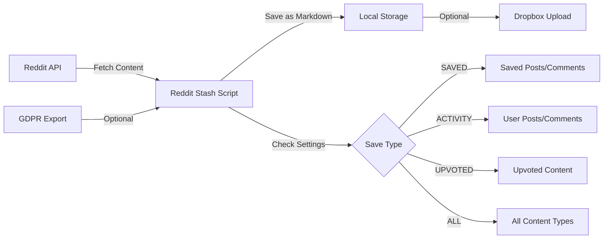
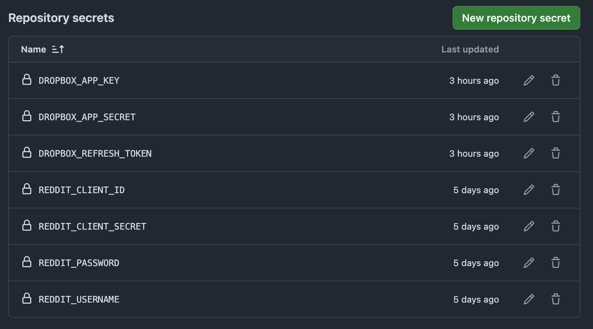
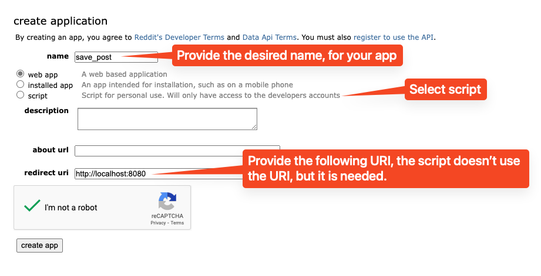
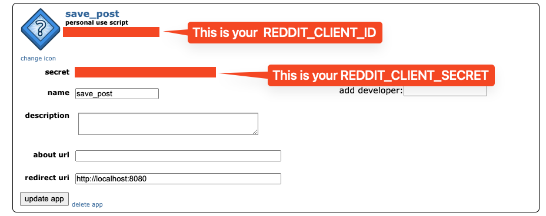
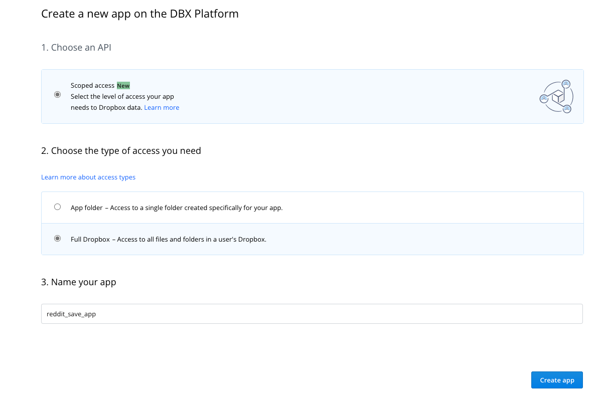
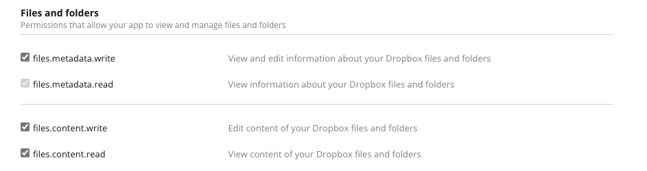
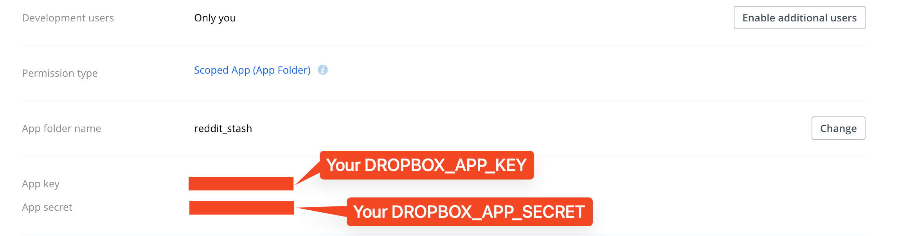
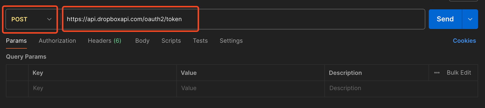
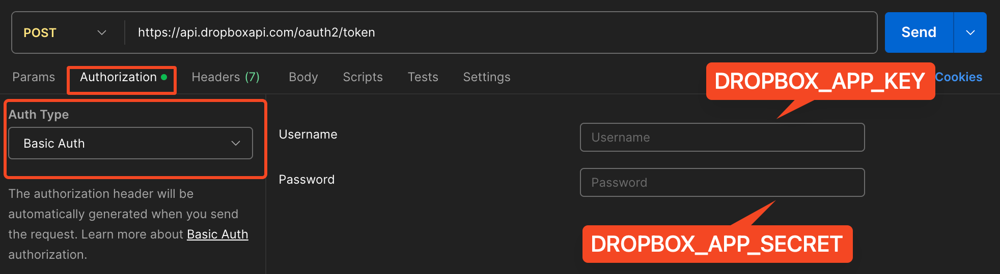
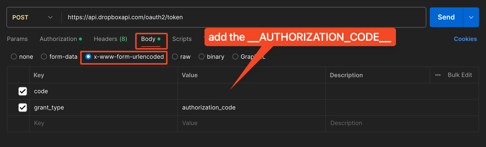

# Reddit Stash: Automatically Save Reddit Posts and Comments to Local or Dropbox

[](https://www.python.org/)
[](https://github.com/features/actions)
[](https://www.dropbox.com/)
[](https://www.reddit.com/dev/api/)
[](LICENSE)

**Reddit Stash** is a Python script designed to help you effortlessly back up your Reddit **saved/ posted/ upvoted** posts and comments to Dropbox or your local machine. Utilizing GitHub Actions, this script runs every 2 hours during peak hours and twice during off-peak hours, automating the process of archiving your Reddit data in Dropbox after a simple setup.

## 📋 What You Get

When Reddit Stash runs successfully, your saved content is organized by subreddit in a clean folder structure and stored as markdown files:

```
reddit/
├── r_AskReddit/
│   ├── POST_abcd123.md           # Your posted content
│   ├── COMMENT_efgh456.md        # Your comments
│   ├── SAVED_POST_xyz789.md      # Posts you saved
│   └── SAVED_COMMENT_def012.md   # Comments you saved
├── r_ProgrammerHumor/
│   ├── UPVOTE_POST_ghi345.md     # Posts you upvoted
│   ├── UPVOTE_COMMENT_mno901.md  # Comments you upvoted
│   └── GDPR_POST_jkl678.md       # From GDPR export (if enabled)
├── gdpr_data/                    # GDPR CSV files (if processing enabled)
│   ├── saved_posts.csv
│   └── saved_comments.csv
└── file_log.json                 # Tracks processed items
```

Each post and comment is formatted with:
- Original title and content
- Author information
- Post/comment URL
- Timestamp
- Subreddit details
- Any images or links from the original post

## Table of Contents
- [What You Get](#-what-you-get)
- [How It Works](#how-it-works)
- [Quick Start](#-quick-start)
  - [Setup Method Comparison](#setup-method-comparison)
- [Key Features](#key-features)
- [Why Use Reddit Stash](#-why-use-reddit-stash)
- [Setup](#setup)
  - [Prerequisites](#prerequisites)
  - [Installation](#installation)
    - [GitHub Action Installation](#github-action-installation-recommended)
    - [Local Installation](#local-installation)
    - [Docker Installation](#docker-installation)
  - [Setup Verification Checklist](#setup-verification-checklist)
- [Configuration](#configuration)
  - [Settings.ini File](#settingsini-file)
  - [Setting Up Reddit Environment Variables](#setting-up-reddit-environment-variables)
  - [Setting Up Dropbox App](#setting-up-dropbox-app)
- [Important Notes](#important-notes)
  - [About Unsaving](#important-note-about-unsaving)
  - [GDPR Data Processing](#gdpr-data-processing)
- [File Organization and Utilities](#file-organization-and-utilities)
- [Frequently Asked Questions](#frequently-asked-questions)
- [Troubleshooting](#-troubleshooting)
- [Security Considerations](#-security-considerations)
- [Contributing](#contributing)
- [Acknowledgement](#acknowledgement)
- [Project Status](#project-status)
  - [Resolved Issues](#resolved-issues)
  - [Future Enhancements](#future-enhancements)
- [License](#license)

## How It Works



### Workflow Summary

1. **Data Collection**:
   - The script connects to Reddit's API to fetch your saved, posted, or upvoted content
   - Optionally, it can process your GDPR export data for a complete history

2. **Processing & Organization**:
   - Content is processed based on your settings (SAVED, ACTIVITY, UPVOTED, or ALL)
   - Files are organized by subreddit in a clean folder structure
   - A log file tracks all processed items to avoid duplicates

3. **Storage Options**:
   - Local storage: Content is saved as markdown files on your machine
   - Cloud storage: Optional integration with Dropbox for backup

4. **Deployment Methods**:
   - **GitHub Actions**: Fully automated with scheduled runs and Dropbox integration
   - **Local Installation**: Run manually or schedule with cron jobs on your machine
   - **Docker**: Run in a containerized environment with optional volume mounts

The script is designed to be flexible, allowing you to choose how you collect, process, and store your Reddit content.

## ⚡ Quick Start

For those who want to get up and running quickly, here's a streamlined process:

### Option 1: GitHub Actions (Easiest Setup)

1. Fork this repository.
2. Set up the required secrets in your GitHub repository:
   - From Reddit: `REDDIT_CLIENT_ID`, `REDDIT_CLIENT_SECRET`, `REDDIT_USERNAME`, `REDDIT_PASSWORD`
   - From Dropbox: `DROPBOX_APP_KEY`, `DROPBOX_APP_SECRET`, `DROPBOX_REFRESH_TOKEN`
3. Manually trigger the workflow from the Actions tab.

### Option 2: Local Installation

1. Clone the repository:
   ```bash
   git clone https://github.com/YOUR_USERNAME/reddit-stash.git
   cd reddit-stash
   ```
   Replace `YOUR_USERNAME` with your GitHub username (or use `rhnfzl` if using the original repository).
2. Install dependencies:
   ```bash
   pip install -r requirements.txt
   ```
3. Set up your environment variables and run:
   ```bash
   python reddit_stash.py
   ```

### Option 3: Docker Installation

1. Build the Docker image:
   ```bash
   docker build -t reddit-stash .
   ```
2. Run with your environment variables:
   ```bash
   docker run -it \
     -e REDDIT_CLIENT_ID=your_client_id \
     -e REDDIT_CLIENT_SECRET=your_client_secret \
     -e REDDIT_USERNAME=your_username \
     -e REDDIT_PASSWORD=your_password \
     -e DROPBOX_APP_KEY=your_dropbox_key \
     -e DROPBOX_APP_SECRET=your_dropbox_secret \
     -e DROPBOX_REFRESH_TOKEN=your_dropbox_token \
     -v $(pwd)/reddit:/app/reddit \
     reddit-stash
   ```

For detailed setup instructions, continue reading the [Setup](#setup) section.

### Setup Method Comparison

| Feature | GitHub Actions | Local Installation | Docker |
|---------|---------------|-------------------|--------|
| **Ease of Setup** | ⭐⭐⭐ (Easiest) | ⭐⭐ | ⭐⭐ |
| **Automation** | ✅ Runs on schedule | ✅ Manual control or cron | ✅ Can be scheduled |
| **Requirements** | GitHub account | Python 3.10-3.12 | Docker |
| **Data Storage** | Dropbox required | Local or Dropbox | Local or Dropbox |
| **Maintenance** | Minimal | More hands-on | Medium |
| **Privacy** | Credentials in GitHub secrets | Credentials on local machine | Credentials in container |
| **Best For** | Set & forget users | Power users with customization needs | Users with existing Docker infrastructure |

## Key Features

- 🤖 **Automated Reddit Backup:** Automatically retrieves saved posts and comments from Reddit, even your posts and comments if you set it up.
- 🔄 **Flexible Storage Options:** Allows for flexible saving options (all activity or only saved items) via `settings.ini`.
- 📦 **Dropbox Integration:** Downloads and uploads the files to Dropbox for storage.
- 📝 **Markdown Support:** Saves the content as markdown files.
- 🔍 **File Deduplication:** Uses intelligent file existence checking to avoid re-downloading content.
- ⏱️ **Rate Limit Management:** Implements dynamic sleep timers to respect Reddit's API rate limits.
- 🔒 **GDPR Data Processing:** Optional processing of Reddit's GDPR export data.

## 🎯 Why Use Reddit Stash

Reddit Stash was designed with specific use cases in mind:

### 1. Overcome Reddit's Limitations
Reddit only shows your most recent 1000 saved posts. With Reddit Stash, you can save everything and go beyond this limitation.

### 2. Create a Personal Knowledge Base
Many users save technical posts, tutorials, or valuable discussions on Reddit. Reddit Stash helps you build a searchable archive of this knowledge.

### 3. Preserve Content Before It's Deleted
Reddit posts and comments can be deleted by users or moderation. Reddit Stash preserves this content in your personal archive.

### 4. Access Your Content Offline
All of your saved posts are available locally in markdown format, making them easily accessible even without an internet connection.

### 5. Integration with Note-Taking Systems
Since content is saved in markdown, you can easily import it into note-taking systems like Obsidian, Notion, or any markdown-compatible tool.

## Setup

### Prerequisites
- ✅ Python 3.10-3.12 (Python 3.12 recommended for best performance)
- 🔑 Reddit API credentials
- 📊 A Dropbox account with an API token

#### Python Version Benefits
- **Python 3.10**: Minimum supported version, stable and reliable
- **Python 3.11**: ~15% performance improvement, better error messages
- **Python 3.12**: Additional optimizations, enhanced f-strings, improved debugging

### Installation

Before proceeding with any installation method, ensure that you have set the Reddit environment variables. Follow [Reddit API guide](#setting-up-reddit-environment-variables) to create a Reddit app and obtain the necessary credentials.

#### GitHub Action Installation (Recommended)

**Note:** The following process requires the [Dropbox App setup](#setting-up-dropbox-app). The GitHub Actions workflow runs the script every 2 hours during peak hours (8:00-23:00 CET) and twice during off-peak hours (1:00 and 5:00 CET), uploading the files to Dropbox. The workflow is defined in `.github/workflows/reddit_scraper.yml`.

1. **Fork this repository**.

2. **Set Up Secrets:**
- Go to your forked repository's **Settings** > **Secrets and variables** > **Actions** > Click on **New repository secret**.
- Add the following secrets individually:
    - `REDDIT_CLIENT_ID`
    - `REDDIT_CLIENT_SECRET`
    - `REDDIT_USERNAME`
    - `REDDIT_PASSWORD`
    For Dropbox Setup
    - `DROPBOX_APP_KEY`
    - `DROPBOX_APP_SECRET`
    - `DROPBOX_REFRESH_TOKEN`
- Enter the respective secret values without any quotes.

After adding all secrets: .

3. **Manually Trigger the Workflow**:
- Go to the **Actions** tab > Select the **Reddit Stash Scraper** from the list on the left > Click **Run workflow** > Select the branch `main` > Click the green **Run workflow** button. The workflow will then be triggered, and you can monitor its progress in the Actions tab. Upon successful completion, you should see the Reddit folder in your Dropbox.

4. The workflow runs automatically on a schedule:
   - Every 2 hours during *peak hours* (8:00-23:00 CET time in summer)
   - Twice during *off-peak hours* (1:00 and 5:00 CET time in summer)
   - You can adjust these times in the workflow file to match your timezone if needed.

5. **Additional Workflows**: The repository includes additional automated workflows for maintenance:
   - `python-compatibility.yml`: Tests compatibility across Python versions 3.10-3.12
   - `claude.yml` and `claude-code-review.yml`: AI-assisted code review workflows

#### Local Installation

1. **Clone this repository**:
   ```
   git clone https://github.com/YOUR_USERNAME/reddit-stash.git
   cd reddit-stash
   ```
   Replace `YOUR_USERNAME` with your GitHub username (or use `rhnfzl` if using the original repository).

2. Install the required Python packages:
    ```
    pip install -r requirements.txt
    ```

3. Setup the [Dropbox App setup](#setting-up-dropbox-app). Skip it if you don't want to setup the dropbox and only want to save the file locally in your system.

4. Edit the settings.ini file, here is [how to](#settingsini-file)

5. Set Environment Variables (Optional but preferred):

    For macOS and Linux:
    ```
    export REDDIT_CLIENT_ID='your_client_id'
    export REDDIT_CLIENT_SECRET='your_client_secret'
    export REDDIT_USERNAME='your_username'
    export REDDIT_PASSWORD='your_password'
    # Optional, if you need dropbox locally
    export DROPBOX_APP_KEY='dropbox-app-key'
    export DROPBOX_APP_SECRET='dropbox-secret-key'
    export DROPBOX_REFRESH_TOKEN='dropbox-secret-key'
    ```

    For Windows:

    ```
    set REDDIT_CLIENT_ID='your_client_id'
    set REDDIT_CLIENT_SECRET='your_client_secret'
    set REDDIT_USERNAME='your_username'
    set REDDIT_PASSWORD='your_password'
    # Optional, if you need dropbox locally
    set DROPBOX_APP_KEY='dropbox-app-key'
    set DROPBOX_APP_SECRET='dropbox-secret-key'
    set DROPBOX_REFRESH_TOKEN='dropbox-secret-key'
    ```
    
    You can verify the setup with:
    ```
    echo $REDDIT_CLIENT_ID
    echo $REDDIT_CLIENT_SECRET
    echo $REDDIT_USERNAME
    echo $REDDIT_PASSWORD
    echo $DROPBOX_APP_KEY
    echo $DROPBOX_APP_SECRET
    echo $DROPBOX_REFRESH_TOKEN
    ```

6. Usage:
    * First-time setup:
    ```
    python reddit_stash.py
    ```
    To upload to Dropbox (optional):
    ```
    python dropbox_utils.py --upload
    ```
    * Subsequent runs, as per your convenience:
    1. Download from Dropbox (optional):
    ```
    python dropbox_utils.py --download
    ```
    2. Process Reddit saved items:
    ```
    python reddit_stash.py
    ```
    3. Upload to Dropbox (optional):
    ```
    python dropbox_utils.py --upload
    ```

#### Docker Installation

You can run Reddit Stash in a Docker container for isolation and consistent environment across different systems.

**1. Build the Docker image**:
```bash
# Build with default Python 3.12
docker build -t reddit-stash .

# Build with specific Python version (optional)
docker build --build-arg PYTHON_VERSION=3.11 -t reddit-stash .
docker build --build-arg PYTHON_VERSION=3.10 -t reddit-stash .
```

**2. Run the container for standard operation**:

**Linux/macOS:**
```bash
docker run -it \
  -e REDDIT_CLIENT_ID=your_client_id \
  -e REDDIT_CLIENT_SECRET=your_client_secret \
  -e REDDIT_USERNAME=your_username \
  -e REDDIT_PASSWORD=your_password \
  -e DROPBOX_APP_KEY=your_dropbox_key \
  -e DROPBOX_APP_SECRET=your_dropbox_secret \
  -e DROPBOX_REFRESH_TOKEN=your_dropbox_token \
  -v $(pwd)/reddit:/app/reddit \
  reddit-stash
```

**Windows Command Prompt:**
```cmd
docker run -it ^
  -e REDDIT_CLIENT_ID=your_client_id ^
  -e REDDIT_CLIENT_SECRET=your_client_secret ^
  -e REDDIT_USERNAME=your_username ^
  -e REDDIT_PASSWORD=your_password ^
  -e DROPBOX_APP_KEY=your_dropbox_key ^
  -e DROPBOX_APP_SECRET=your_dropbox_secret ^
  -e DROPBOX_REFRESH_TOKEN=your_dropbox_token ^
  -v %cd%/reddit:/app/reddit ^
  reddit-stash
```

**3. Run the container for Dropbox operations**:

**Upload to Dropbox:**
```bash
docker run -it \
  -e DROPBOX_APP_KEY=your_dropbox_key \
  -e DROPBOX_APP_SECRET=your_dropbox_secret \
  -e DROPBOX_REFRESH_TOKEN=your_dropbox_token \
  -v $(pwd)/reddit:/app/reddit \
  reddit-stash dropbox_utils.py --upload
```

**Download from Dropbox:**
```bash
docker run -it \
  -e DROPBOX_APP_KEY=your_dropbox_key \
  -e DROPBOX_APP_SECRET=your_dropbox_secret \
  -e DROPBOX_REFRESH_TOKEN=your_dropbox_token \
  -v $(pwd)/reddit:/app/reddit \
  reddit-stash dropbox_utils.py --download
```

**4. Docker Compose (Alternative Method)**

For easier management, you can use docker-compose:

```bash
# Copy the example environment file
cp .env.example .env

# Edit .env with your credentials
nano .env  # or your preferred editor

# Run the service
docker-compose --profile main up

# For one-time execution
docker-compose --profile oneshot run --rm reddit-stash-oneshot

# For Dropbox operations only
docker-compose --profile dropbox run --rm reddit-stash-dropbox python dropbox_utils.py --upload
```

#### Docker Notes:

- **Python Support**: Build supports Python 3.10, 3.11, and 3.12 (3.12 is default)
- **Security**: The container runs as a non-root user for security
- **Data Persistence**: Data is persisted through a volume mount (`-v $(pwd)/reddit:/app/reddit`) to your local machine
- **Runtime Configuration**: Environment variables must be provided at runtime
- **Flexibility**: The container supports running different scripts (main script, dropbox operations)
- **Interactive Mode**: Use `-it` flags for interactive operation with output visible in your terminal
- **Detached Mode**: You can also run in detached mode with `-d` if you prefer:
  ```bash
  docker run -d \
    -e REDDIT_CLIENT_ID=your_client_id \
    [other environment variables] \
    -v $(pwd)/reddit:/app/reddit \
    reddit-stash
  ```
- **Logging**: Logs are available through Docker's logging system when running in detached mode:
  ```bash
  docker logs <container_id>
  ```

### 🍴 Fork Setup Guide

If you've forked this repository to make custom modifications, follow these setup steps:

#### Using Docker with Your Fork

Docker works the same way with your fork - just build locally:

```bash
# Clone your fork
git clone https://github.com/YOUR_USERNAME/reddit-stash.git
cd reddit-stash

# Build your customized version
docker build -t reddit-stash .

# Run your custom build
docker run -it \
  -e REDDIT_CLIENT_ID=your_client_id \
  -e REDDIT_CLIENT_SECRET=your_client_secret \
  -e REDDIT_USERNAME=your_username \
  -e REDDIT_PASSWORD=your_password \
  -e DROPBOX_APP_KEY=your_dropbox_key \
  -e DROPBOX_APP_SECRET=your_dropbox_secret \
  -e DROPBOX_REFRESH_TOKEN=your_dropbox_token \
  -v $(pwd)/reddit:/app/reddit \
  reddit-stash
```

Replace `YOUR_USERNAME` with your GitHub username.

### Setup Verification Checklist

After completing your chosen installation method, verify that everything is working correctly:

#### For GitHub Actions Setup:
- [ ] Repository forked successfully
- [ ] All required secrets added to repository settings
- [ ] Workflow manually triggered at least once
- [ ] Workflow completes without errors (check Actions tab)
- [ ] Reddit folder appears in your Dropbox account
- [ ] Content files are present and readable

#### For Local Installation:
- [ ] Python 3.10-3.12 installed and working (3.12 recommended)
- [ ] Repository cloned successfully
- [ ] Dependencies installed via `pip install -r requirements.txt`
- [ ] Environment variables set correctly
- [ ] Script runs without errors
- [ ] Content saved to specified directory
- [ ] (Optional) Content uploaded to Dropbox if configured

#### For Docker Installation:
- [ ] Docker installed and daemon running
- [ ] Image built successfully
- [ ] Container runs without errors
- [ ] Content appears in mounted volume
- [ ] (Optional) Content uploaded to Dropbox if configured

## Configuration

#### `settings.ini` File

The `settings.ini` file in the root directory of the project allows you to configure how Reddit Stash operates. Here's what each section of the file does:

```ini
[Settings]
save_directory = reddit/  # your system save directory
dropbox_directory = /reddit  # your dropbox directory
save_type = ALL  # Options: 'ALL' to save all activity, 'SAVED' to save only saved posts/comments, 'ACTIVITY' to save only the users posts and comments, 'UPVOTED' to save users upvoted post and comments
check_type = LOG  # Options: 'LOG' to use the logging file to verify the file existence, 'DIR' to verify the file existence based on the downloaded directory.
unsave_after_download = false
process_gdpr = false  # Whether to process GDPR export data
process_api = true  # Whether to process items from Reddit API (default: true)
ignore_tls_errors = false  # Whether to ignore TLS certificate errors for third-party content (use with caution)

[Configuration]
client_id = None  # Can be set here or via environment variables
client_secret = None  # Can be set here or via environment variables
username = None  # Can be set here or via environment variables
password = None  # Can be set here or via environment variables
```

#### Settings Explained:

* **save_directory**: Specifies the directory where the Reddit content will be saved, modify it to the location you want it to be in.
* **dropbox_directory**: Specifies the folder where the Reddit content will be saved on dropbox, modify it to the location you want it to be in.
* **save_type**: Determines what user activity is saved:
    * `ALL`: Saves all posts and comments made by the user, the saved posts and comments with their context, along with the upvoted posts and comments.
    * `SAVED`: Saves only the posts and comments the user has saved on Reddit with their context.
    * `ACTIVITY`: Saves only the posts and comments user has made/posted on Reddit with their context.
    * `UPVOTED`: Saves only the posts and comments the user has upvoted with their context.
* **check_type**: Determines how file existence is checked:
    * `LOG`: Uses only the log file to check for file existence (faster processing). Recommended for GitHub Actions setup.
    * `DIR`: Checks the saved/downloaded directory for file existence (slower but more thorough). Recommended for local setup.
* **unsave_after_download**: When set to `true`, automatically unsaves posts after downloading them (see notes below).
* **process_gdpr**: When set to `true`, processes GDPR export data (explained in detail below).
* **process_api**: When set to `true` (default), processes items from the Reddit API.
* **ignore_tls_errors**: When set to `true`, ignores TLS certificate errors when downloading images from third-party sites. ⚠️ **Warning**: This reduces security by bypassing SSL certificate verification. Only enable for archival purposes when you explicitly need to download content from sites with expired or invalid certificates.

Note: You can still use environment variables as a fallback or override for the Reddit API credentials if they are not set in the settings.ini file.

#### Setting Up Reddit Environment Variables

* Create a Reddit app at https://www.reddit.com/prefs/apps or https://old.reddit.com/prefs/apps/
* Set up the name, select `script`, and provide the `redirect_uri` as per the [PRAW docs](https://praw.readthedocs.io/en/latest/getting_started/authentication.html#password-flow).



* Copy the provided `REDDIT_CLIENT_ID` and the `REDDIT_CLIENT_SECRET` based on the following screenshot:



* `REDDIT_USERNAME` is your reddit username
* `REDDIT_PASSWORD` is your reddit password

**Important for Two-Factor Authentication (TFA):**
If your Reddit account has TFA enabled, you must provide your password and TFA code together, separated by a colon (`:`), e.g.:
```
REDDIT_PASSWORD='your_password:123456'
```
where `123456` is your current TFA code. Alternatively, you can disable TFA for the account to use prawcore authentication.
If neither is done, prawcore authentication will fail.
Keep these credentials for the setup.

#### Setting Up Dropbox app
* Go to [Dropbox Developer App](https://www.dropbox.com/developers/apps).
* Click on Create app.
* Select `Scoped access` and choose `Full Dropbox` or `App folder` for access type.
* give a Name to your app and click `Create app`.

- In the `Permissions` tab, ensure the following are checked under `Files and folders`:
    * `files.metadata.write`
    * `files.metadata.read`
    * `files.content.write`
    * `files.content.read`
    * Click `Submit` in the bottom.

* Your `DROPBOX_APP_KEY` and `DROPBOX_APP_SECRET` are in the settings page of the app you created.

* To get the `DROPBOX_REFRESH_TOKEN` follow the follwing steps:

Replace `<DROPBOX_APP_KEY>` with your `DROPBOX_APP_KEY` you got in previous step and add that in the below Authorization URL

https://www.dropbox.com/oauth2/authorize?client_id=<DROPBOX_APP_KEY>&token_access_type=offline&response_type=code

Paste the URL in browser and complete the code flow on the Authorization URL. You will receive an `<AUTHORIZATION_CODE>` at the end, save it you will need this later.

Go to [Postman](https://www.postman.com/), and create a new POST request with below configuration

* Add Request URL- https://api.dropboxapi.com/oauth2/token


* Click on the **Authorization** tab -> Type = **Basic Auth** -> **Username** = `<DROPBOX_APP_KEY>` , **Password** = `<DROPBOX_APP_SECRET>`
(Refer this [answer](https://stackoverflow.com/a/28529598/18744450) for cURL -u option)



* Body -> Select "x-www-form-urlencoded"

|    Key   |      Value          |
|:--------:|:-------------------:|
|    code  |`<AUTHORIZATION_CODE>` |
|grant_type| authorization_code  |



After you click send the request, you will receive JSON payload containing **refresh_token**.
```
{
    "access_token": "sl.****************",
    "token_type": "bearer",
    "expires_in": 14400,
    "refresh_token": "*********************",
    "scope": <SCOPES>,
    "uid": "**********",
    "account_id": "***********************"
}
```

and add/export the above **refresh_token** to DROPBOX_REFRESH_TOKEN in your environment.
For more information about the setup visit [OAuth Guide](https://developers.dropbox.com/oauth-guide).


- Credits for above DROPBOX_REFRESH_TOKEN solution : https://stackoverflow.com/a/71794390/12983596

## Important Notes

### Important Note About Unsaving

⚠️ **The script includes an option to automatically unsave posts after downloading them (`unsave_after_download` in settings.ini). This feature can be used to cycle through older saved posts beyond Reddit's 1000-item limit.**

#### How it works:
1. The script downloads and saves a post/comment
2. If successful, it attempts to unsave the item
3. A small delay is added between unsave operations to respect Reddit's rate limits
4. Error handling ensures that failed unsaves don't stop the script

#### Important Considerations:
- **This process is irreversible** - Once items are unsaved, they cannot be automatically restored to your saved items list
- **Create backups first** - Always ensure you have a backup of your saved items before enabling this feature
- **Use with caution** - It's recommended to first run the script without unsaving to verify everything works as expected
- **Rate Limiting** - The script includes built-in delays to avoid hitting Reddit's API limits
- **Error Recovery** - If an unsave operation fails, the script will continue processing other items

#### Usage:
1. Set `unsave_after_download = true` in your settings.ini file
2. Run the script as normal
3. The script will now unsave items after successfully downloading them
4. Run the script multiple times to gradually access older saved items

#### Recommended Workflow:
1. First run: Keep `unsave_after_download = false` and verify all content downloads correctly
2. Create a backup of your downloaded content
3. Enable unsaving by setting `unsave_after_download = true`
4. Run the script multiple times to access progressively older content

### GDPR Data Processing

The script can process Reddit's GDPR data export to access your complete saved post history. This feature uses PRAW to fetch full content for each saved item in your export.

#### How to Use GDPR Export:

1. Request your Reddit data:
   - Go to https://www.reddit.com/settings/data-request
   - Request your data (processing may take several days)
   - Download the ZIP file when ready

2. Extract and place the CSV files:
   - Inside your save directory (from settings.ini), create a `gdpr_data` folder
   - Example structure:
     ```
     reddit/              # Your save directory
     ├── gdpr_data/      # GDPR data directory
     │   ├── saved_posts.csv
     │   └── saved_comments.csv
     ├── subreddit1/     # Regular saved content
     └── file_log.json
     ```

3. Enable GDPR processing:
   ```ini
   [Settings]
   process_gdpr = true
   ```

4. Run the script:
   ```bash
   python reddit_stash.py
   ```

#### Technical Details:
- Uses PRAW's built-in rate limiting
- Processes both submissions and comments
- Maintains consistent file naming with "GDPR_" prefix
- Integrates with existing file logging system
- Handles API errors and retries gracefully

#### Important Notes:
- GDPR processing runs after regular API processing
- Each item requires a separate API call to fetch full content
- Rate limits are shared with regular API processing
- Large exports may take significant time to process
- Duplicate items are automatically skipped via file logging

### File Organization and Utilities

Reddit Stash organizes content by subreddit with a clear file naming convention:

- **Your Posts**: `POST_[post_id].md`
- **Your Comments**: `COMMENT_[comment_id].md`
- **Saved Posts**: `SAVED_POST_[post_id].md`
- **Saved Comments**: `SAVED_COMMENT_[comment_id].md`
- **Upvoted Posts**: `UPVOTE_POST_[post_id].md`
- **Upvoted Comments**: `UPVOTE_COMMENT_[comment_id].md`
- **GDPR Posts**: `GDPR_POST_[post_id].md`
- **GDPR Comments**: `GDPR_COMMENT_[comment_id].md`

The system includes several utility modules:

- **file_operations.py**: Handles all file saving and organization logic
- **save_utils.py**: Contains the core content formatting functions
- **gdpr_processor.py**: Processes the GDPR data export
- **time_utilities.py**: Manages rate limiting and API request timing
- **log_utils.py**: Tracks processed files to avoid duplicates

## Frequently Asked Questions

### General Questions

**Q: Why would I want to backup my Reddit content?**  
A: Reddit only allows you to access your most recent 1000 saved items. This tool lets you preserve everything beyond that limit and ensures you have a backup even if content is removed from Reddit.

**Q: How often does the automated backup run?**  
A: If you use the GitHub Actions setup, it runs on a schedule:
- Every 2 hours during peak hours (8:00-23:00 CET time in summer)
- Twice during off-peak hours (1:00 and 5:00 CET time in summer)

**Q: Can I run this without GitHub Actions?**  
A: Yes, you can run it locally on your machine or set up the Docker container version. The README provides instructions for both options.

### Technical Questions

**Q: Does this access private/NSFW subreddits I've saved content from?**  
A: Yes, as long as you're logged in with your own Reddit credentials, the script can access any content you've saved, including from private or NSFW subreddits.

**Q: How can I verify the script is working correctly?**  
A: Check your specified save directory for the backed-up files. They should be organized by subreddit with clear naming conventions.

**Q: Will this impact my Reddit account in any way?**  
A: No, unless you enable the `unsave_after_download` option. This script only reads your data by default; it doesn't modify anything on Reddit unless that specific option is enabled.

**Q: What happens if the script encounters rate limits?**  
A: The script has built-in dynamic sleep timers to respect Reddit's API rate limits. It will automatically pause and retry when necessary.

## 🔧 Troubleshooting

If you encounter issues with Reddit Stash, here are solutions to common problems:

### Authentication Issues

**Problem**: "Invalid credentials" or "Authentication failed" errors
- **Solution**: 
  1. Double-check your Reddit API credentials
  2. Ensure your Reddit account is verified with an email address
  3. Make sure your app is properly set up with the correct redirect URI
  4. Verify that your password is correct (for local installations)

### Rate Limiting

**Problem**: "Too many requests" or frequent pauses during execution
- **Solution**: 
  1. This is normal behavior to respect Reddit's API limits
  2. The script will automatically slow down and retry
  3. For larger archives, consider running at off-peak hours
  4. Try reducing the frequency of scheduled runs in GitHub Actions

### Empty Results

**Problem**: Script runs successfully but no files are saved
- **Solution**: 
  1. Verify that your Reddit account has saved posts/comments
  2. Check your `settings.ini` file to ensure the correct `save_type` is selected
  3. Look at the console output for any warnings or errors
  4. Make sure your file paths in settings.ini are correct

### Dropbox Issues

**Problem**: Files aren't appearing in Dropbox
- **Solution**: 
  1. Verify your Dropbox API credentials and refresh token
  2. Check that your Dropbox app has the correct permissions
  3. Run `python dropbox_utils.py --upload` manually to test the upload
  4. Look for error messages during the upload process

### GitHub Actions Workflow Failures

**Problem**: GitHub Actions workflow fails
- **Solution**: 
  1. Check the workflow logs for detailed error messages
  2. Verify all required secrets are set correctly
  3. Make sure your Dropbox token hasn't expired
  4. Check for changes in the Reddit API that might affect the script

If you're experiencing issues not covered here, please open an issue on GitHub with details about the problem and any error messages you received.

## 🔐 Security Considerations

When using Reddit Stash, keep these security considerations in mind:

### API Credentials

- **Never share your Reddit API credentials** or Dropbox tokens with others
- When using GitHub Actions, your credentials are stored as encrypted secrets
- For local installations, consider using environment variables instead of hardcoding credentials in the settings file
- Regularly rotate your API keys and tokens, especially if you suspect they may have been compromised

### Content Security

- Reddit Stash downloads and stores all content from saved posts, including links and images
- Be aware that this may include sensitive or private information if you've saved such content
- Consider where you're storing the backed-up content and who has access to that location
- Dropbox encryption provides some protection, but for highly sensitive data, consider additional encryption

### GitHub Actions Security

- The GitHub Actions workflow runs in GitHub's cloud environment
- While GitHub has strong security measures, be aware that your Reddit content is processed in this environment
- The workflow has access to your repository secrets and the content being processed
- For maximum security, consider running the script locally on a trusted machine

### Local Storage Considerations

- Content is stored in plain text markdown files
- If storing content locally, ensure your device has appropriate security measures (encryption, access controls)
- If you back up your local storage to other services, be mindful of where your Reddit content might end up

## Contributing

Feel free to open issues or submit pull requests if you have any improvements or bug fixes.

### Acknowledgement
- This project was inspired by [reddit-saved-saver](https://github.com/tobiasvl/reddit-saved-saver).

## Project Status

### Resolved Issues
✅ The dropbox authentication now works correctly with refresh tokens  
✅ The script implements early exit strategy while fetching content for better efficiency  
✅ Added Docker support for local containerization  
✅ Added processing of the GDPR export data from Reddit

### Future Enhancements
Have an idea for improving Reddit Stash? Feel free to suggest it in the issues or contribute a pull request!

- [ ] Improve error handling for edge cases
- [ ] Add support for additional cloud storage providers
- [ ] Create a simple web interface for configuration
- [ ] Add metrics and statistics about saved content

## License

This project is licensed under the MIT License - see the [LICENSE](LICENSE) file for details.

This means you are free to:
- Use the software for commercial purposes
- Modify the software
- Distribute the software
- Use the software privately

With the condition that you include the original copyright notice and license in any copy of the software/source.
