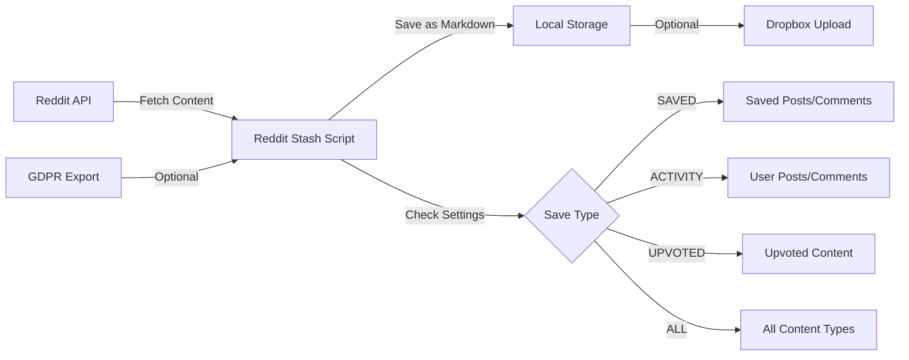
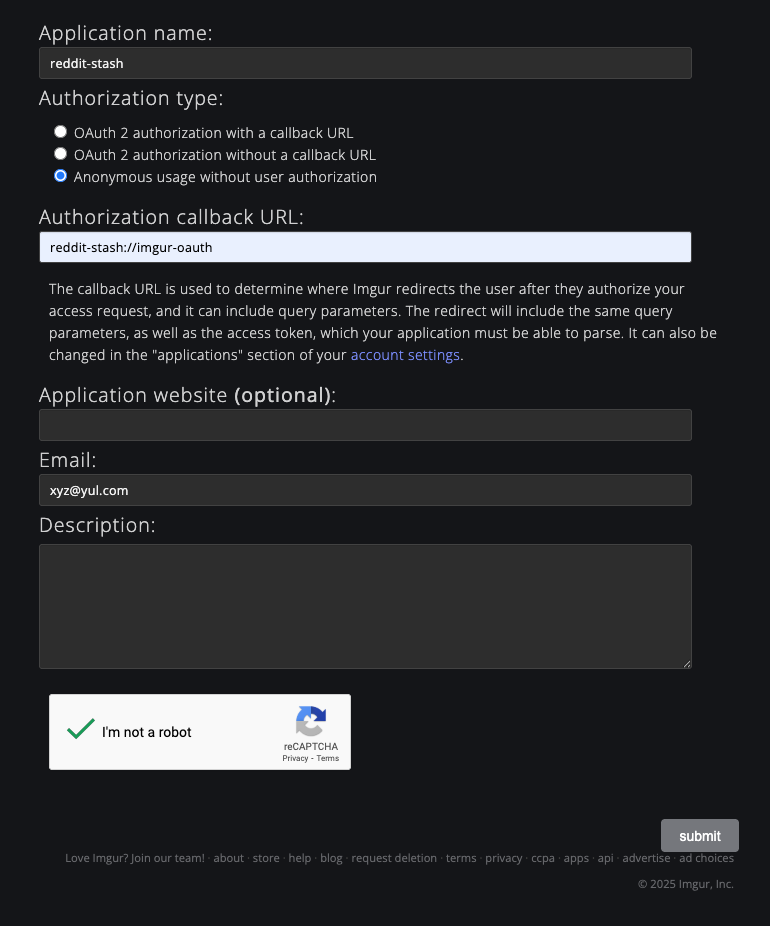
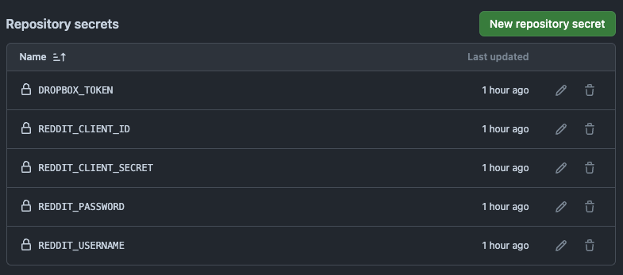
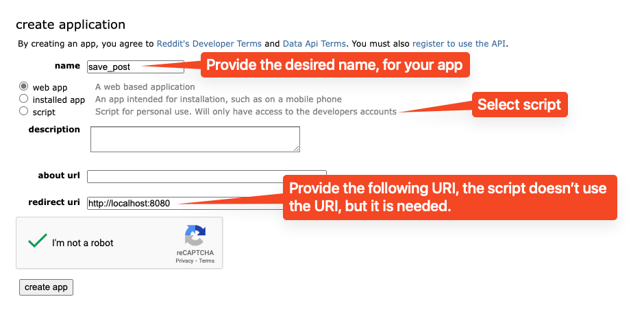
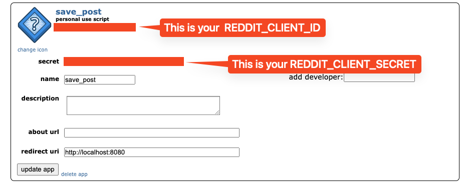
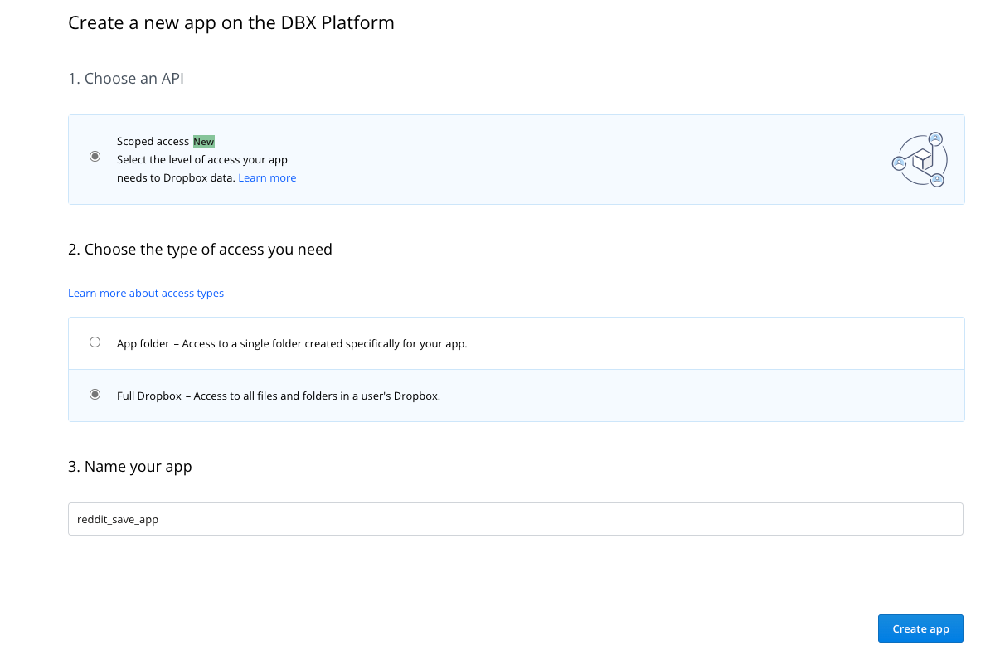
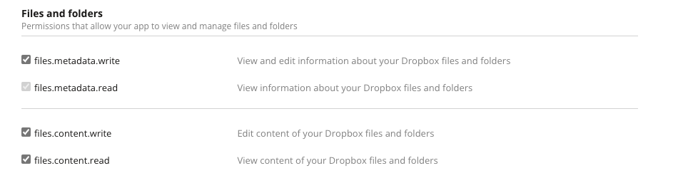

# Reddit Stash: Automatically Save Reddit Posts and Comments to Dropbox

[](https://www.python.org/)
[](https://github.com/features/actions)
[](https://www.dropbox.com/)
[](https://www.reddit.com/dev/api/)
[](LICENSE)

**Reddit Stash** is a Python script designed to help you effortlessly back up your Reddit **saved/ posted/ upvoted** posts and comments to Dropbox or your local machine. Utilizing GitHub Actions, this script runs daily, automating the process of archiving your Reddit data in Dropbox after a simple setup.

## 📋 What You Get

When Reddit Stash runs successfully, your saved content is organized by subreddit in a clean folder structure and stored as markdown files:

```
reddit/
├── r_AskReddit/
│   ├── POST_abcd123.md
│   └── COMMENT_efgh456.md
├── r_ProgrammerHumor/
│   └── POST_ijkl789.md
└── file_log.json
```

Each post and comment is formatted with:
- Original title and content
- Author information
- Post/comment URL
- Timestamp
- Subreddit details
- Any images or links from the original post

## Table of Contents
- [What You Get](#-what-you-get)
- [How It Works](#how-it-works)
- [Quick Start](#-quick-start)
  - [Setup Method Comparison](#setup-method-comparison)
- [Key Features](#key-features)
- [Why Use Reddit Stash](#-why-use-reddit-stash)
- [Setup](#setup)
  - [Prerequisites](#prerequisites)
  - [Installation](#installation)
    - [GitHub Action Installation](#github-action-installation-recommended)
    - [Local Installation](#local-installation)
    - [Docker Installation](#docker-installation)
  - [Setup Verification Checklist](#setup-verification-checklist)
- [Configuration](#configuration)
  - [Settings.ini File](#settingsini-file)
  - [Setting Up Reddit Environment Variables](#setting-up-reddit-environment-variables)
  - [Setting Up Dropbox App](#setting-up-dropbox-app)
  - [Setting Up Imgur API](#setting-up-imgur-api)
- [Media Handling](#media-handling)
  - [Image Processing](#image-processing)
  - [Video Support](#video-support)
  - [Enhanced Imgur Support](#enhanced-imgur-support)
  - [Deleted Content Recovery](#deleted-content-recovery)
  - [Audio Support](#audio-support)
  - [Configuration Options](#configuration-options)
- [Important Notes](#important-notes)
  - [Important Note About Unsaving](#important-note-about-unsaving)
  - [GDPR Data Processing](#gdpr-data-processing)
- [File Organization and Utilities](#file-organization-and-utilities)
- [Frequently Asked Questions](#frequently-asked-questions)
- [Troubleshooting](#-troubleshooting)
- [Security Considerations](#-security-considerations)
- [Contributing](#contributing)
- [Acknowledgement](#acknowledgement)
- [Project Status](#project-status)
  - [Resolved Issues](#resolved-issues)
  - [Future Enhancements](#future-enhancements)
- [License](#license)

## How It Works


```mermaid
graph LR
    A[Reddit API] -->|Fetch Content| B[Reddit Stash Script]
    B -->|Save as Markdown| C[Local Storage]
    B -->|Check Settings| D{Save Type}
    D -->|SAVED| E[Saved Posts/Comments]
    D -->|ACTIVITY| F[User Posts/Comments]
    D -->|UPVOTED| G[Upvoted Content]
    D -->|ALL| H[All Content Types]
    C -->|Optional| I[Dropbox Upload]
    J[GDPR Export] -->|Optional| B
```

### Workflow Summary

1. **Data Collection**:
   - The script connects to Reddit's API to fetch your saved, posted, or upvoted content
   - Optionally, it can process your GDPR export data for a complete history

2. **Processing & Organization**:
   - Content is processed based on your settings (SAVED, ACTIVITY, UPVOTED, or ALL)
   - Files are organized by subreddit in a clean folder structure
   - A log file tracks all processed items to avoid duplicates

3. **Storage Options**:
   - Local storage: Content is saved as markdown files on your machine
   - Cloud storage: Optional integration with Dropbox for backup

4. **Deployment Methods**:
   - **GitHub Actions**: Fully automated with scheduled runs and Dropbox integration
   - **Local Installation**: Run manually or schedule with cron jobs on your machine
   - **Docker**: Run in a containerized environment with optional volume mounts

The script is designed to be flexible, allowing you to choose how you collect, process, and store your Reddit content.

## ⚡ Quick Start

For those who want to get up and running quickly, here's a streamlined process:

### Option 1: GitHub Actions (Easiest Setup)

1. Fork this repository.
2. Set up the required secrets in your GitHub repository:
   - From Reddit: `REDDIT_CLIENT_ID`, `REDDIT_CLIENT_SECRET`, `REDDIT_USERNAME`
   - From Dropbox: `DROPBOX_APP_KEY`, `DROPBOX_APP_SECRET`, `DROPBOX_REFRESH_TOKEN`
   - For Imgur Support (Optional)
     - `IMGUR_CLIENT_IDS` (comma-separated list if using multiple IDs)
     - `IMGUR_CLIENT_SECRETS` (comma-separated list, optional for anonymous usage)
   - For Content Recovery (Optional - only needed if you want to override settings.ini defaults)
    - `USE_WAYBACK_MACHINE` (true/false)
    - `USE_PUSHSHIFT_API` (true/false)
    - `USE_REDDIT_PREVIEWS` (true/false)
    - `USE_REVEDDIT_API` (true/false)
    - `RECOVERY_TIMEOUT` (seconds)
3. Manually trigger the workflow from the Actions tab.

### Option 2: Local Installation

1. Clone the repository:
   ```bash
   git clone https://github.com/rhnfzl/reddit-stash.git
   cd reddit-stash
   ```
2. Install dependencies:
   ```bash
   pip install -r requirements.txt
   ```
3. Set up your environment variables and run:
   ```bash
   python reddit_stash.py
   ```

For detailed setup instructions, continue reading the [Setup](#setup) section.

### Setup Method Comparison

| Feature | GitHub Actions | Local Installation | Docker |
|---------|---------------|-------------------|--------|
| **Ease of Setup** | ⭐⭐⭐ (Easiest) | ⭐⭐ | ⭐⭐ |
| **Automation** | ✅ Runs on schedule | ❌ Manual or requires cron | ✅ Can be scheduled |
| **Requirements** | GitHub account | Python 3.10 | Docker |
| **Data Storage** | Dropbox required | Local or Dropbox | Local or Dropbox |
| **Maintenance** | Minimal | More hands-on | Medium |
| **Privacy** | Credentials in GitHub secrets | Credentials on local machine | Credentials in container |
| **Best For** | Set & forget users | Power users with customization needs | Users with existing Docker infrastructure |

## Key Features

- 🤖 **Automated Reddit Backup:** Automatically retrieves saved posts and comments from Reddit, even your posts and comments if you set it up.
- 🔄 **Flexible Storage Options:** Allows for flexible saving options (all activity or only saved items) via `settings.ini`.
- 📦 **Dropbox Integration:** Downloads and uploads the files to Dropbox for storage.
- 📝 **Markdown Support:** Saves the content as markdown files.
- 🔍 **File Deduplication:** Uses intelligent file existence checking to avoid re-downloading content.
- ⏱️ **Rate Limit Management:** Implements dynamic sleep timers to respect Reddit's API rate limits.
- 🔒 **GDPR Data Processing:** Optional processing of Reddit's GDPR export data.
- 🎬 **Enhanced Media Support:** Downloads and saves images, videos, and audio from various platforms.
- 🖼️ **Thumbnail Generation:** Creates thumbnails for large images to save space while preserving access to full-resolution images.
- 📱 **Multi-Platform Media:** Supports Reddit videos, Gfycat, Imgur, Streamable, YouTube thumbnails, and more.

### Media Handling

Reddit Stash now includes enhanced media handling capabilities:

#### Image Processing

- **Automatic Image Download:** Images from posts and comments are automatically downloaded and saved locally
- **Thumbnail Generation:** Large images (over 5MB by default) have thumbnails generated to save space
- **Markdown Integration:** Images are embedded in markdown with proper formatting and links to originals

#### Video Support

- **Multi-Platform Support:** Downloads videos from:
  - Reddit's native video hosting (v.redd.it)
  - Gfycat
  - Imgur (GIFs and videos)
  - Streamable
- **Quality Options:** Configure video quality in settings.ini (high or low)
- **YouTube Thumbnails:** For YouTube links, thumbnails are embedded with links to the original videos

#### Enhanced Imgur Support

- **Album Downloading:** Complete Imgur albums are downloaded and saved in a structured format
- **API Integration:** Uses the Imgur API for reliable album and image retrieval
- **API Key Rotation:** Supports multiple Imgur API keys to avoid rate limits
- **Deleted Content Recovery:** Attempts to recover deleted Imgur content using alternative methods
- **Flexible Configuration:** Control album downloading behavior through settings

#### Deleted Content Recovery

- **Multi-Method Recovery:** Uses multiple approaches to recover deleted or unavailable media:
  - **Wayback Machine Integration:** Checks the Internet Archive for snapshots of deleted content
  - **PullPush API:** Leverages the PullPush.io archive (successor to Pushshift) to find deleted posts and comments
  - **Reveddit API:** Uses Reveddit.com to recover removed Reddit content
  - **Reddit Previews:** Extracts preview images and thumbnails from Reddit's API
  - **Imgur-Specific Methods:** Uses specialized techniques for recovering Imgur content
- **Configurable:** Enable or disable specific recovery methods through settings
- **Fallback Chain:** Tries multiple methods in sequence for the best chance of recovery
- **Detailed Logging:** Provides information about which recovery method succeeded

##### Setting Up Imgur API

To enable enhanced Imgur support and avoid rate limiting errors, you should set up Imgur API credentials:

1. Go to [Imgur API Client Registration](https://api.imgur.com/oauth2/addclient)
2. Fill in the application details:
   - Application name: "Reddit Stash" (or your preferred name)
   - Authorization type: "Anonymous usage without user authorization"
   - Email and description: Your information
   - Authorization callback URL: "reddit-stash://imgur-oauth"
3. Submit the form to create your application



4. Copy your Client ID and Client Secret (optional)
5. Configure these credentials either:
   - In your settings.ini file under the [Imgur] section
   - As environment variables (IMGUR_CLIENT_IDS, IMGUR_CLIENT_SECRETS)
   - As GitHub repository secrets for automated workflows

##### Using Multiple Imgur API Credentials (Recommended)

Imgur has strict rate limits (approximately 1,250 requests per day for free accounts). To overcome these limitations, Reddit Stash supports using multiple API credentials with automatic rotation:

1. **Create Multiple Imgur Applications**:
   - Repeat the application creation process above 2-3 times
   - Use slightly different application names (e.g., "Reddit Stash 1", "Reddit Stash 2")
   - Keep track of all the Client IDs and Client Secrets

2. **Configure Multiple Credentials**:

   **Option 1: In settings.ini**:
   ```ini
   [Imgur]
   # Comma-separated list of client IDs
   client_ids = abc123,def456,ghi789
   # Comma-separated list of client secrets (optional, can be omitted)
   client_secrets = secret1,secret2,secret3
   ```

   **Option 2: As environment variables**:
   ```bash
   # For macOS/Linux
   export IMGUR_CLIENT_IDS="abc123,def456,ghi789"
   export IMGUR_CLIENT_SECRETS="secret1,secret2,secret3"
   
   # For Windows
   set IMGUR_CLIENT_IDS=abc123,def456,ghi789
   set IMGUR_CLIENT_SECRETS=secret1,secret2,secret3
   ```

   **Option 3: As GitHub repository secrets**:
   - Create a secret named `IMGUR_CLIENT_IDS` with comma-separated values
   - Create a secret named `IMGUR_CLIENT_SECRETS` with comma-separated values (optional)

3. **How Credential Rotation Works**:
   - Reddit Stash automatically rotates through the provided credentials
   - Each API request uses the next credential in the list
   - If a rate limit is encountered, the system will try the next credential
   - The rotation system tracks usage and distributes requests evenly
   - For optimal results, provide at least 2-3 different credentials

4. **Client Secrets (Optional)**:
   - Client secrets are optional for anonymous Imgur API usage
   - If provided, they must be in the same order as client IDs
   - If you have fewer secrets than IDs, the system will use `None` for missing secrets
   - Example: If you have 3 client IDs but only 2 secrets, the third ID will use anonymous access

5. **Monitoring API Usage**:
   - The script logs remaining API credits when available
   - Watch for messages like: "Imgur API credits remaining: X/Y"
   - If you frequently see low numbers, consider adding more API credentials

This credential rotation system allows Reddit Stash to handle significantly more Imgur content without hitting rate limits. With 3 API credentials, you can effectively triple your daily request limit.

For detailed configuration options and multiple API key setup, see the [Media Handling](#media-handling) section.

> **Important**: Without Imgur API credentials, you may experience rate limiting (HTTP 429 errors) when downloading Imgur content. Free API credentials provide a much higher rate limit.

##### Setting Up Content Recovery Services

Unlike Imgur, the content recovery services (PullPush, Reveddit, and Wayback Machine) don't require API keys for basic usage. They're enabled by default and can be configured through settings:

1. **Configuration Options**:

   **Option 1: Settings.ini File**
   ```ini
   [Recovery]
   # Enable/disable different recovery methods for deleted content
   use_wayback_machine = true
   use_pushshift_api = true  # Now uses PullPush.io (successor to Pushshift)
   use_reddit_previews = true
   use_reveddit_api = true   # Uses Reveddit.com API to find removed content
   # Timeout in seconds for recovery API requests
   timeout_seconds = 10
   ```

   **Option 2: Environment Variables**
   ```bash
   # For macOS/Linux
   export USE_WAYBACK_MACHINE=true
   export USE_PUSHSHIFT_API=true
   export USE_REDDIT_PREVIEWS=true
   export USE_REVEDDIT_API=true
   export RECOVERY_TIMEOUT=10
   
   # For Windows
   set USE_WAYBACK_MACHINE=true
   set USE_PUSHSHIFT_API=true
   set USE_REDDIT_PREVIEWS=true
   set USE_REVEDDIT_API=true
   set RECOVERY_TIMEOUT=10
   ```

2. **Advanced Recovery Features**:
   - **Dynamic Timeouts**: The system uses intelligent timeout calculations based on request complexity
   - **Automatic Retries**: Each API request will be retried up to 3 times with exponential backoff
   - **Jittered Delays**: Random jitter is added to timeouts to prevent thundering herd problems
   - **Rate Limit Handling**: The system detects rate limiting (HTTP 429) and backs off appropriately
   - **Detailed Logging**: All recovery attempts are logged with timing information for troubleshooting

3. **Recovery Process**:
   - When a media URL can't be downloaded directly, the system tries multiple recovery methods in sequence
   - First, it checks Reddit's previews and thumbnails
   - Then, it queries the PullPush API (successor to Pushshift)
   - Next, it tries the Reveddit API
   - Then, it checks the Wayback Machine
   - Finally, it falls back to Imgur-specific recovery methods (for Imgur content)

4. **Service Information**:
   - **PullPush.io**: A successor to Pushshift that maintains an archive of Reddit content
   - **Reveddit.com**: A service that specializes in showing removed content from Reddit
   - **Wayback Machine**: The Internet Archive's service that takes snapshots of web pages over time

#### Audio Support

- **Audio File Download:** Supports downloading audio files (.mp3, .wav, .ogg, etc.)
- **Comment Processing:** Detects and downloads audio files linked in comments

#### Configuration Options

The `settings.ini` file includes new sections for media handling:

```ini
[Media]
# Enable/disable media type downloads
download_videos = true
download_images = true
download_audio = true
# Maximum size in pixels for thumbnails (width or height)
thumbnail_size = 800
# Maximum size in bytes for images before generating thumbnails (5MB default)
max_image_size = 5000000
# Video quality: 'high' or 'low'
video_quality = high

[Imgur]
# Imgur API client IDs (comma-separated for rotation)
# Register at https://api.imgur.com/oauth2/addclient
# IMPORTANT: To avoid 429 rate limit errors, register for free Imgur API credentials
# 1. Go to https://api.imgur.com/oauth2/addclient
# 2. Register for OAuth 2 application without callback
# 3. Add your client_id below (and optionally client_secret)
client_ids = None
# Imgur API client secrets (comma-separated, optional for anonymous usage)
# Must be in the same order as client_ids if provided
client_secrets = None
# Download albums (may increase API usage)
download_albums = true
# Maximum number of images to download from an album (0 = no limit)
max_album_images = 50
# Attempt to recover deleted Imgur content
recover_deleted = true

[Recovery]
# Enable/disable different recovery methods for deleted content
use_wayback_machine = true
# Now uses PullPush.io (successor to Pushshift)
use_pushshift_api = true
# Uses Reddit's preview system to find removed images
use_reddit_previews = true
# Uses Reveddit.com API to find removed content
use_reveddit_api = true
# Timeout in seconds for recovery API requests
timeout_seconds = 10
```

These settings allow you to customize how media is handled according to your preferences and storage constraints.

## 🎯 Why Use Reddit Stash

Reddit Stash was designed with specific use cases in mind:

### 1. Overcome Reddit's Limitations
Reddit only shows your most recent 1000 saved posts. With Reddit Stash, you can save everything and go beyond this limitation.

### 2. Create a Personal Knowledge Base
Many users save technical posts, tutorials, or valuable discussions on Reddit. Reddit Stash helps you build a searchable archive of this knowledge.

### 3. Preserve Content Before It's Deleted
Reddit posts and comments can be deleted by users or moderation. Reddit Stash preserves this content in your personal archive.

### 4. Access Your Content Offline
All of your saved posts are available locally in markdown format, making them easily accessible even without an internet connection.

### 5. Integration with Note-Taking Systems
Since content is saved in markdown, you can easily import it into note-taking systems like Obsidian, Notion, or any markdown-compatible tool.

## Setup

### Prerequisites
- ✅ Python 3.10
- 🔑 Reddit API credentials
- 📊 A Dropbox account with an API token

### Installation

Before proceeding with any installation method, ensure that you have set the Reddit environment variables. Follow [Reddit API guide](#setting-up-reddit-environment-variables) to create a Reddit app and obtain the necessary credentials.

#### GitHub Action Installation (Recommended)

**Note:** The following process requires the [Dropbox App setup](#setting-up-dropbox-app). The GitHub Actions workflow runs the script daily at midnight CET, uploading the files to Dropbox. The workflow is defined in `.github/workflows/reddit_scraper.yml`.

1. **Fork this repository**.

2. **Set Up Secrets:**
- Go to your forked repository's **Settings** > **Secrets and variables** > **Actions** > Click on **New repository secret**.
- Add the following secrets individually:
    - `REDDIT_CLIENT_ID`
    - `REDDIT_CLIENT_SECRET`
    - `REDDIT_USERNAME`
   For Dropbox Setup
    - `DROPBOX_APP_KEY`
    - `DROPBOX_APP_SECRET`
    - `DROPBOX_REFRESH_TOKEN`
   For Imgur Support (Optional)
    - `IMGUR_CLIENT_IDS` (comma-separated list if using multiple IDs)
    - `IMGUR_CLIENT_SECRETS` (comma-separated list, optional for anonymous usage)
   For Content Recovery (Optional - only needed if you want to override settings.ini defaults)
    - `USE_WAYBACK_MACHINE` (true/false)
    - `USE_PUSHSHIFT_API` (true/false)
    - `USE_REDDIT_PREVIEWS` (true/false)
    - `USE_REVEDDIT_API` (true/false)
    - `RECOVERY_TIMEOUT` (seconds)
- Enter the respective secret values without any quotes.

After adding all secrets: .

3. **Manually Trigger the Workflow**:
- Go to the **Actions** tab > Select the **Reddit Stash Workflow** from the list on the left > Click **Run workflow** > Select the branch `main` > Click the green **Run workflow** button. The workflow will then be triggered, and you can monitor its progress in the Actions tab. Upon successful completion, you should see the Reddit folder in your Dropbox.

4. The workflow runs automatically on a schedule:
   - Every 2 hours during *peak hours* (8:00-23:00 CET time in summer)
   - Twice during *off-peak hours* (1:00 and 5:00 CET time in summer)
   - You can adjust these times in the workflow file to match your timezone if needed.

#### Local Installation

1. **Clone this repository**:
   ```
   git clone https://github.com/rhnfzl/reddit-stash.git
   cd reddit-stash
   ```

2. Install the required Python packages:
    ```
    pip install -r requirements.txt
    ```

3. Setup the [Dropbox App setup](#setting-up-dropbox-app). Skip it if you don't want to setup the dropbox and only want to save the file locally in your system.

4. Edit the settings.ini file, here is [how to](#`settings.ini`-file)

5. Set Environment Variables (Optional but preferred):

    For macOS and Linux:
    ```
    export REDDIT_CLIENT_ID='your_client_id'
    export REDDIT_CLIENT_SECRET='your_client_secret'
    export REDDIT_USERNAME='your_username'
    export REDDIT_PASSWORD='your_password'
    # Optional, if you need dropbox locally
    export DROPBOX_APP_KEY='dropbox-app-key'
    export DROPBOX_APP_SECRET='dropbox-secret-key'
    export DROPBOX_REFRESH_TOKEN='dropbox-secret-key'
    # Optional, for Imgur API support
    export IMGUR_CLIENT_IDS='your_imgur_client_id' # or comma-separated list
    export IMGUR_CLIENT_SECRETS='your_imgur_client_secret' # optional
    # Optional - only needed if you want to override settings.ini defaults
    export USE_WAYBACK_MACHINE=true
    export USE_PUSHSHIFT_API=true
    export USE_REDDIT_PREVIEWS=true
    export USE_REVEDDIT_API=true
    export RECOVERY_TIMEOUT=10
    ```

    For Windows:

    ```
    set REDDIT_CLIENT_ID='your_client_id'
    set REDDIT_CLIENT_SECRET='your_client_secret'
    set REDDIT_USERNAME='your_username'
    set REDDIT_PASSWORD='your_password'
    # Optional, if you need dropbox locally
    set DROPBOX_APP_KEY='dropbox-app-key'
    set DROPBOX_APP_SECRET='dropbox-secret-key'
    set DROPBOX_REFRESH_TOKEN='dropbox-secret-key'
    # Optional, for Imgur API support
    set IMGUR_CLIENT_IDS='your_imgur_client_id'
    set IMGUR_CLIENT_SECRETS='your_imgur_client_secret'
    # Optional - only needed if you want to override settings.ini defaults
    set USE_WAYBACK_MACHINE=true
    set USE_PUSHSHIFT_API=true
    set USE_REDDIT_PREVIEWS=true
    set USE_REVEDDIT_API=true
    set RECOVERY_TIMEOUT=10
    ```
    
    You can verify the setup with:
    ```
    echo $REDDIT_CLIENT_ID
    echo $REDDIT_CLIENT_SECRET
    echo $REDDIT_USERNAME
    echo $REDDIT_PASSWORD
    echo $DROPBOX_APP_KEY
    echo $DROPBOX_APP_SECRET
    echo $DROPBOX_REFRESH_TOKEN
    echo $IMGUR_CLIENT_IDS
    echo $IMGUR_CLIENT_SECRETS
    # Optional recovery settings
    echo $USE_WAYBACK_MACHINE
    echo $USE_PUSHSHIFT_API
    echo $USE_REDDIT_PREVIEWS
    echo $USE_REVEDDIT_API
    echo $RECOVERY_TIMEOUT
    ```

6. Usage:
    * First-time setup:
    ```
    python reddit_stash.py
    ```
    To upload to Dropbox (optional):
    ```
    python dropbox_utils.py --upload
    ```
    * Subsequent runs, as per your convenience:
    1. Download from Dropbox (optional):
    ```
    python dropbox_utils.py --download
    ```
    2. Process Reddit saved items:
    ```
    python reddit_stash.py
    ```
    3. Upload to Dropbox (optional):
    ```
    python dropbox_utils.py --upload
    ```

#### Docker Installation

You can run Reddit Stash in a Docker container. This method provides isolation and ensures consistent environment across different systems.

1. **Build the Docker image**:
   ```bash
   docker build -t reddit-stash .
   ```

2. **Run the container for standard operation**:
   ```bash
   docker run -it \
     -e REDDIT_CLIENT_ID=your_client_id \
     -e REDDIT_CLIENT_SECRET=your_client_secret \
     -e REDDIT_USERNAME=your_username \
     -e REDDIT_PASSWORD=your_password \
     -e DROPBOX_APP_KEY=your_dropbox_key \
     -e DROPBOX_APP_SECRET=your_dropbox_secret \
     -e DROPBOX_REFRESH_TOKEN=your_dropbox_token \
     -e IMGUR_CLIENT_IDS=your_imgur_client_ids \
     -e IMGUR_CLIENT_SECRETS=your_imgur_client_secrets \
     # Optional - only needed if you want to override settings.ini defaults
     -e USE_WAYBACK_MACHINE=true \
     -e USE_PUSHSHIFT_API=true \
     -e USE_REDDIT_PREVIEWS=true \
     -e USE_REVEDDIT_API=true \
     -e RECOVERY_TIMEOUT=10 \
     -v $(pwd)/reddit:/app/reddit \
     reddit-stash
   ```

   For Windows Command Prompt, use:
   ```cmd
   docker run -it ^
     -e REDDIT_CLIENT_ID=your_client_id ^
     -e REDDIT_CLIENT_SECRET=your_client_secret ^
     -e REDDIT_USERNAME=your_username ^
     -e REDDIT_PASSWORD=your_password ^
     -e DROPBOX_APP_KEY=your_dropbox_key ^
     -e DROPBOX_APP_SECRET=your_dropbox_secret ^
     -e DROPBOX_REFRESH_TOKEN=your_dropbox_token ^
     -e IMGUR_CLIENT_IDS=your_imgur_client_ids ^
     -e IMGUR_CLIENT_SECRETS=your_imgur_client_secrets ^
     REM Optional - only needed if you want to override settings.ini defaults
     -e USE_WAYBACK_MACHINE=true ^
     -e USE_PUSHSHIFT_API=true ^
     -e USE_REDDIT_PREVIEWS=true ^
     -e USE_REVEDDIT_API=true ^
     -e RECOVERY_TIMEOUT=10 ^
     -v %cd%/reddit:/app/reddit ^
     reddit-stash
   ```

3. **Run the container for Dropbox operations**:

   To upload to Dropbox:
   ```bash
   docker run -it \
     -e DROPBOX_APP_KEY=your_dropbox_key \
     -e DROPBOX_APP_SECRET=your_dropbox_secret \
     -e DROPBOX_REFRESH_TOKEN=your_dropbox_token \
     -v $(pwd)/reddit:/app/reddit \
     reddit-stash dropbox_utils.py --upload
   ```

   To download from Dropbox:
   ```bash
   docker run -it \
     -e DROPBOX_APP_KEY=your_dropbox_key \
     -e DROPBOX_APP_SECRET=your_dropbox_secret \
     -e DROPBOX_REFRESH_TOKEN=your_dropbox_token \
     -v $(pwd)/reddit:/app/reddit \
     reddit-stash dropbox_utils.py --download
   ```

   Windows Command Prompt versions follow the same pattern with `^` for line continuation.

#### Docker Notes:

- The container runs as a non-root user for security
- Data is persisted through a volume mount (`-v $(pwd)/reddit:/app/reddit`) to your local machine
- Environment variables must be provided at runtime
- The container uses an ENTRYPOINT/CMD configuration for flexibility in running different scripts
- We use `-it` flags for interactive operation with output visible in your terminal
- You can also run in detached mode with `-d` if you prefer:
  ```bash
  docker run -d \
    -e REDDIT_CLIENT_ID=your_client_id \
    [other environment variables] \
    -v $(pwd)/reddit:/app/reddit \
    reddit-stash
  ```
- Logs are available through Docker's logging system when running in detached mode:
  ```bash
  docker logs <container_id>
  ```

### Setup Verification Checklist

After completing your chosen installation method, verify that everything is working correctly:

#### For GitHub Actions Setup:
- [ ] Repository forked successfully
- [ ] All required secrets added to repository settings
- [ ] Workflow manually triggered at least once
- [ ] Workflow completes without errors (check Actions tab)
- [ ] Reddit folder appears in your Dropbox account
- [ ] Content files are present and readable

#### For Local Installation:
- [ ] Python 3.10 installed and working
- [ ] Repository cloned successfully
- [ ] Dependencies installed via `pip install -r requirements.txt`
- [ ] Environment variables set correctly
- [ ] Script runs without errors
- [ ] Content saved to specified directory
- [ ] (Optional) Content uploaded to Dropbox if configured

#### For Docker Installation:
- [ ] Docker installed and daemon running
- [ ] Image built successfully
- [ ] Container runs without errors
- [ ] Content appears in mounted volume
- [ ] (Optional) Content uploaded to Dropbox if configured

## Configuration

#### `settings.ini` File

The `settings.ini` file in the root directory of the project allows you to configure how Reddit Stash operates. Here's what each section of the file does:

```ini
[Settings]
save_directory = reddit/ # your system save directory
dropbox_directory = /reddit # your dropbox directory
save_type = ALL  # Options: 'ALL' to save all activity, 'SAVED' to save only saved posts/comments, 'ACTIVITY' to save only the users posts and comments, 'UPVOTED' to save users upvoted post and comments
check_type = LOG # Options: 'LOG' to use the logging file to verify the file exisitnece, 'DIR' to verify the file exisitence based on the downloaded directory. 
unsave_after_download = false
process_gdpr = false # Whether to process GDPR export data
process_api = true # Whether to process items from Reddit API (default: true)
ignore_ssl_errors = true # Whether to ignore SSL certificate errors when downloading content from external sites

[Configuration]
client_id = None  # Can be set here or via environment variables
client_secret = None  # Can be set here or via environment variables
username = None  # Can be set here or via environment variables
password = None  # Can be set here or via environment variables

[Media]
# Media handling settings
download_videos = true
download_images = true
download_audio = true
# Maximum size in pixels for thumbnails (width or height)
thumbnail_size = 800
# Maximum size in bytes for images before generating thumbnails (5MB default)
max_image_size = 5000000
# Video quality: 'high' or 'low'
video_quality = high

[Imgur]
# Imgur API client IDs (comma-separated for rotation)
# Register at https://api.imgur.com/oauth2/addclient
# IMPORTANT: To avoid 429 rate limit errors, register for free Imgur API credentials
# 1. Go to https://api.imgur.com/oauth2/addclient
# 2. Register for OAuth 2 application without callback
# 3. Add your client_id below (and optionally client_secret)
client_ids = None
# Imgur API client secrets (comma-separated, optional for anonymous usage)
# Must be in the same order as client_ids if provided
client_secrets = None
# Download albums (may increase API usage)
download_albums = true
# Maximum number of images to download from an album (0 = no limit)
max_album_images = 50
# Attempt to recover deleted Imgur content
recover_deleted = true

[Recovery]
# Enable/disable different recovery methods for deleted content
use_wayback_machine = true
# Now uses PullPush.io (successor to Pushshift)
use_pushshift_api = true
# Uses Reddit's preview system to find removed images
use_reddit_previews = true
# Uses Reveddit.com API to find removed content
use_reveddit_api = true
# Timeout in seconds for recovery API requests
timeout_seconds = 10
```

#### Settings Explained:

* **save_directory**: Specifies the directory where the Reddit content will be saved, modify it to the location you want it to be in.
* **dropbox_directory**: Specifies the folder where the Reddit content will be saved on dropbox, modify it to the location you want it to be in.
* **save_type**: Determines what user activity is saved:
    * `ALL`: Saves all posts and comments made by the user, the saved posts and comments with their context, along with the upvoted posts and comments.
    * `SAVED`: Saves only the posts and comments the user has saved on Reddit with their context.
    * `ACTIVITY`: Saves only the posts and comments user has made/posted on Reddit with their context.
    * `UPVOTED`: Saves only the posts and comments the user has upvoted with their context.
* **check_type**: Determines how file existence is checked:
    * `LOG`: Uses only the log file to check for file existence (faster processing). Recommended for GitHub Actions setup.
    * `DIR`: Checks the saved/downloaded directory for file existence (slower but more thorough). Recommended for local setup.
* **unsave_after_download**: When set to `true`, automatically unsaves posts after downloading them (see notes below).
* **process_gdpr**: When set to `true`, processes GDPR export data (explained in detail below).
* **process_api**: When set to `true` (default), processes items from the Reddit API.
* **ignore_ssl_errors**: When set to `true`, ignores SSL certificate verification errors when downloading content from external sites. This is useful for archival purposes when some links have expired or invalid certificates, but comes with security risks. Use with caution.

**Media Settings:**
* **download_videos**: When set to `true`, downloads videos from posts and comments.
* **download_images**: When set to `true`, downloads images from posts and comments.
* **download_audio**: When set to `true`, downloads audio files from posts and comments.
* **thumbnail_size**: Maximum width or height in pixels for generated thumbnails.
* **max_image_size**: Maximum size in bytes for images before generating thumbnails (default: 5MB).
* **video_quality**: Quality setting for downloaded videos (`high` or `low`).

**Imgur Settings:**
* **client_ids**: Comma-separated list of Imgur API client IDs for API access.
* **client_secrets**: Optional comma-separated list of Imgur API client secrets.
* **download_albums**: When set to `true`, downloads complete Imgur albums.
* **max_album_images**: Maximum number of images to download from an album (0 = no limit).
* **recover_deleted**: When set to `true`, attempts to recover deleted Imgur content.

**Recovery Settings:**
* **use_wayback_machine**: When set to `true`, checks the Internet Archive for deleted content.
* **use_pushshift_api**: When set to `true`, uses PullPush.io to find deleted posts/comments.
* **use_reddit_previews**: When set to `true`, extracts preview images from Reddit's API.
* **use_reveddit_api**: When set to `true`, uses Reveddit.com to recover removed content.
* **timeout_seconds**: Timeout in seconds for recovery API requests.

Note: You can still use environment variables as a fallback or override for the Reddit API credentials if they are not set in the settings.ini file.

#### Setting Up Reddit Environment Variables

* Create a Reddit app at https://www.reddit.com/prefs/apps or https://old.reddit.com/prefs/apps/
* Set up the name, select `script`, and provide the `redirect_uri` as per the [PRAW docs](https://praw.readthedocs.io/en/latest/getting_started/authentication.html#password-flow).



* Copy the provided `REDDIT_CLIENT_ID` and the `REDDIT_CLIENT_SECRET` based on the following screenshot:



* `REDDIT_USERNAME` is your reddit username
* `REDDIT_PASSWORD` is your reddit passowrd
Keep these credentials for the setup.

#### Setting Up Dropbox app
* Go to [Dropbox Developer App](https://www.dropbox.com/developers/apps).
* Click on Create app.
* Select `Scoped access` and choose `Full Dropbox` or `App folder` for access type.
* give a Name to your app and click `Create app`.

- In the `Permissions` tab, ensure the following are checked under `Files and folders`:
    * `files.metadata.write`
    * `files.metadata.read`
    * `files.content.write`
    * `files.content.read`
    * Click `Submit` in the bottom.

* Your `DROPBOX_APP_KEY` and `DROPBOX_APP_SECRET` are provided after creating the app.

## Important Notes

### Important Note About Unsaving

⚠️ **The script includes an option to automatically unsave posts after downloading them (`unsave_after_download` in settings.ini). This feature can be used to cycle through older saved posts beyond Reddit's 1000-item limit.**

#### How it works:
1. The script downloads and saves a post/comment
2. If successful, it attempts to unsave the item
3. A small delay is added between unsave operations to respect Reddit's rate limits
4. Error handling ensures that failed unsaves don't stop the script

#### Important Considerations:
- **This process is irreversible** - Once items are unsaved, they cannot be automatically restored to your saved items list
- **Create backups first** - Always ensure you have a backup of your saved items before enabling this feature
- **Use with caution** - It's recommended to first run the script without unsaving to verify everything works as expected
- **Rate Limiting** - The script includes built-in delays to avoid hitting Reddit's API limits
- **Error Recovery** - If an unsave operation fails, the script will continue processing other items

#### Usage:
1. Set `unsave_after_download = true` in your settings.ini file
2. Run the script as normal
3. The script will now unsave items after successfully downloading them
4. Run the script multiple times to gradually access older saved items

#### Recommended Workflow:
1. First run: Keep `unsave_after_download = false` and verify all content downloads correctly
2. Create a backup of your downloaded content
3. Enable unsaving by setting `unsave_after_download = true`
4. Run the script multiple times to access progressively older content

### GDPR Data Processing

The script can process Reddit's GDPR data export to access your complete saved post history. This feature uses PRAW to fetch full content for each saved item in your export.

#### How to Use GDPR Export:

1. Request your Reddit data:
   - Go to https://www.reddit.com/settings/data-request
   - Request your data (processing may take several days)
   - Download the ZIP file when ready

2. Extract and place the CSV files:
   - Inside your save directory (from settings.ini), create a `gdpr_data` folder
   - Example structure:
     ```
     reddit/              # Your save directory
     ├── gdpr_data/      # GDPR data directory
     │   ├── saved_posts.csv
     │   └── saved_comments.csv
     ├── subreddit1/     # Regular saved content
     └── file_log.json
     ```

3. Enable GDPR processing:
   ```ini
   [Settings]
   process_gdpr = true
   ```

4. Run the script:
   ```bash
   python reddit_stash.py
   ```

#### Technical Details:
- Uses PRAW's built-in rate limiting
- Processes both submissions and comments
- Maintains consistent file naming with "GDPR_" prefix
- Integrates with existing file logging system
- Handles API errors and retries gracefully

#### Important Notes:
- GDPR processing runs after regular API processing
- Each item requires a separate API call to fetch full content
- Rate limits are shared with regular API processing
- Large exports may take significant time to process
- Duplicate items are automatically skipped via file logging

## File Organization and Utilities

Reddit Stash includes utilities for managing your saved content, including:

- **dropbox_utils.py**: A script for uploading and downloading files to and from Dropbox.
- **reddit_stash.py**: The main script for running the Reddit Stash.

## Frequently Asked Questions

### How do I troubleshoot issues with Reddit Stash?

If you encounter issues, please check the [Troubleshooting](#-troubleshooting) section for common issues and solutions. If the problem persists, please open an issue on the GitHub repository.

## Troubleshooting

### Common Issues and Solutions

1. **Rate Limit Errors**: If you receive HTTP 429 errors, it may be due to exceeding Reddit's API rate limits. Consider using a proxy or rotating API keys.
2. **SSL Certificate Errors**: If you encounter SSL certificate errors, ensure that your system's date and time are correct and that your network connection is stable.
3. **File Deduplication**: If you experience issues with file deduplication, ensure that your system's file system is not corrupted and that the script is running correctly.

## Security Considerations

Reddit Stash handles sensitive data, including your Reddit API credentials and saved content. Ensure that you:

- **Protect your credentials**: Do not share your credentials with others.
- **Use secure methods**: When setting up Reddit Stash, use secure methods to protect your credentials.
- **Monitor for security threats**: Regularly check for any unauthorized access or data breaches.

## Contributing

We welcome contributions from the community! If you're interested in contributing to Reddit Stash, please follow the steps below:

1. **Fork the repository**: Click the "Fork" button on the top right of this repository page.
2. **Clone the repository**: Clone your forked repository to your local machine.
   ```bash
   git clone https://github.com/your-username/reddit-stash.git
   cd reddit-stash
   ```
3. **Create a new branch**: Create a new branch for your changes.
   ```bash
   git checkout -b feature-name
   ```
4. **Make your changes**: Make your changes in the code.
5. **Commit your changes**: Commit your changes with a meaningful commit message.
   ```bash
   git add .
   git commit -m "Added new feature"
   git push origin feature-name
   ```
6. **Open a pull request**: Open a pull request from your forked repository to the main repository.

## Acknowledgement

Reddit Stash was created by [Your Name](https://github.com/your-username).

## Project Status

### Resolved Issues

- [ ] Issue 1: Description of the issue
- [ ] Issue 2: Description of the issue

### Future Enhancements

- [ ] Feature 1: Description of the feature
- [ ] Feature 2: Description of the feature

## License

Reddit Stash is licensed under the MIT License. See the [LICENSE](LICENSE) file for more information.